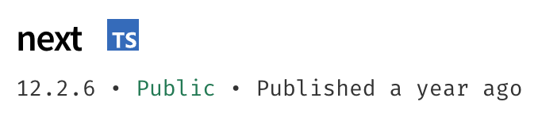
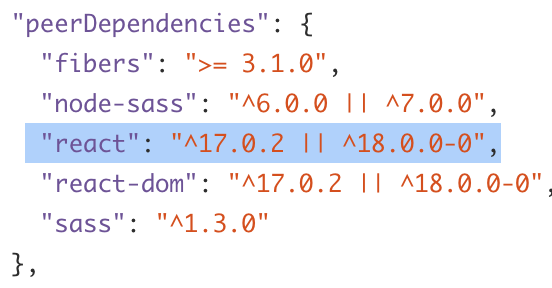
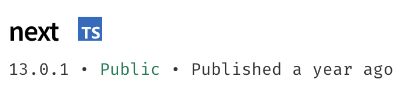
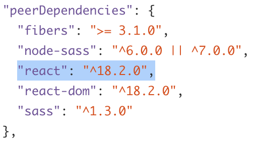
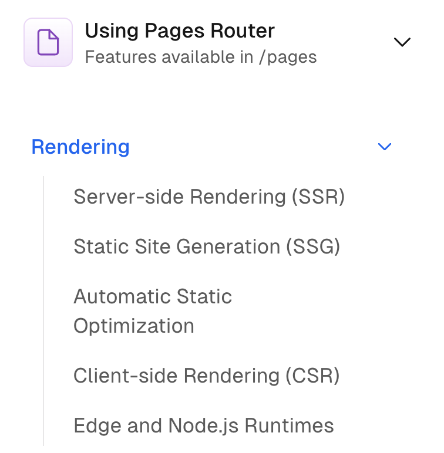
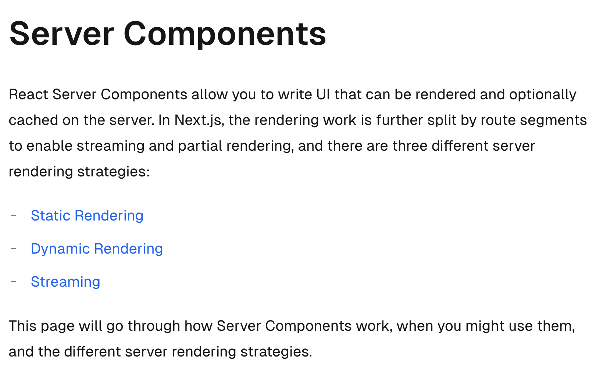

## 목차

## Next.js의 SSR은 무엇을 위해 존재하는가?

React의 Meta framework인 Next를 떠올리면 가장 먼저 연상되는 키워드는 SSR(Server Side Rendering)일 것이다.

기본적으로 React는 CSR(Client Side Rendering)으로 동작하기 때문에, SSR을 수행하기 위해서는 **Express와 같은 server**위에 React의 [**Server React DOM API**](https://react.dev/reference/react-dom/server)를 사용하거나 **Next와 같은 React Meta Framework**를 통해 가능하다.

요즘은 직접 SSR 환경을 구축해서 사용하는 경우보다는, Next를 사용하는 케이스가 많다. 그럼 일단 Next Docs에서 말하는 SSR을 살펴보자.

> 일단 Next 12버전까지는 직접적으로 SSR이라는 단어를 Docs에서 언급하지만, **13버전 App router** 도입 이후는 **Dynamic Rendering**이라고 말하면서, SSR이라는 단어를 직접적으로 사용하지 않는다. 이에 대해서는 v12와 v13의 차이를 알고나면 자연스레 이해될 수 있는 부분이기 때문에, 천천히 뒤의 내용을 살펴보자.

먼저, **Next v12의 page router Docs를 기반**으로 이야기해보자.

> If a page uses Server-side Rendering, the page HTML is generated on each request.
>
> [Nextjs Docs | Server-side Rendering (SSR)](https://nextjs.org/docs/pages/building-your-application/rendering/server-side-rendering)

Nextjs Docs에서는 SSR를 사용하면, **각 요청마다 HTML 페이지가 생성**된다고 이야기한다.

> To use Server-side Rendering for a page, you need to `export` an `async` function called `getServerSideProps`. This function will be called by the server on every request.
>
> [Nextjs Docs | Server-side Rendering (SSR)](https://nextjs.org/docs/pages/building-your-application/rendering/server-side-rendering)

그리고 **Page Router 기반의 Nextjs**에서, SSR을 사용하기 위해서는 `getServerSideProps`라는 async 함수를 export 해야한다. 이 함수는 **매 요청마다, 서버에서 실행된다고 한다.**

> For example, suppose that your page needs to pre-render frequently updated data (fetched from an external API). You can write getServerSideProps which fetches this data and passes it to Page like below

그리고 각 page가 **external API**로부터 수신한 데이터를 **pre-render**하기 위해서는 `getServerSideProps`를 통해서 데이터를 수신하고 page에 pass하여 렌더링을 수행한다.

```jsx
export default function Page({ data }) {
  // Render data...
}

// This gets called on every request
export async function getServerSideProps() {
  // Fetch data from external API
  const res = await fetch(`https://.../data`)
  const data = await res.json()

  // Pass data to the page via props
  return { props: { data } }
}
```

이렇게 SSR을 했을 때 취할 수 있는 이점이나 해결할 수 있는 문제는 무엇일까?

#### 1. SEO

항상 SSR의 장점에 대해 이야기하면 놓치지 않고 끼어드는 녀석인 SEO이다.

간단하게 설명하면, **React의 CSR은 결국 HTML 깡통에 JS가 로드되면 동적으로 페이지를 그려넣는 방식**이기 때문에, **검색엔진** 입장에서는 **JS까지 모두 내려받아야만 웹 사이트의 내용을 확인**할 수 있다.

하지만 **SSR**은 미리 **HTML 페이지를 pre-render**해서 내려보내기 때문에, 검색 엔진이 데이터를 더 빠르게 찾을 수 있다.

[검색 엔진은 기본적으로, 크롤러를 통해 웹 페이지를 찾고 인덱싱을 통해 DB에 해당 페이지의 내용을 분석한 결과(키워드, 컨텐츠 유형 등)를 저장한다.](https://ahrefs.com/blog/google-search-algorithm/)

구글 봇과 같은 크롤러가 웹 사이트를 찾아서 인덱싱을 수행하려고 할때, 만약 CSR으로 작동하는 경우는 **웹 페이지 초기 로드시에 JS가 로드되지 않으면 검색 엔진이 제대로 인덱싱을 수행할 수 없다.**

JS를 완전히 로드한 후에 인덱싱을 수행하는 등의 특별한 처리가 들어가지 않는 이상, **HTML을 pre-render해서 요청에 응답하는 SSR 방식이 검색 엔진 최적화에 더 이점**이 있다.

물론 Google 검색 엔진은 [CSR과 같은 Dynamic Rendering 환경에도 크롤러가 중간에 Renderer를 끼고 인덱싱을 수행](https://developers.google.com/search/docs/crawling-indexing/javascript/dynamic-rendering?hl=ko) 할 수 있다. 하지만 권장되는 방법이 아닌, 임시방편이라고 명시한다.

> Google 검색 센터 Docs의 SEO 기본 가이드를 참고하면, 구글에서 설명하는 SEO에 대한 기본적인 원리나 방법을 알 수 있다.
>
> [Google 검색 센터 Docs | SEO 기본 가이드](https://developers.google.com/search/docs/fundamentals/seo-starter-guide?hl=ko)

만약 SEO가 중요한 비즈니스 요구 사항이라면, Next의 SSR 기능이 유용할 것이다.

#### 2. UX

React와 Next의 동작 방식 차이를 생각해보면, 유저가 웹 사이트에 접근했을 때 UX의 차이도 자연스럽게 유추할 수 있다.

✅ **React**는 먼저 아주 **가벼운 HTML**을 받아서, 전체 웹사이트를 렌더링할 수 있는 **JS Bundle**를 요청해서 받아온다.

✅ **Next**는 각 요청마다, **해당 페이지의 HTML을 즉시 rendering**해서 보낸다. 이후 필요한 **js chunk들은 hydration**되어 웹사이트가 interactive하게 된다.

그럼 **React**는 JS Bundle을 받아서 **'동적으로 HTML을 생성하기 전까지 유저는 화면을 볼 수 없고'**, **Next**는 먼저 렌더링 된 HTML을 내려주기 때문에 **'일단 유저가 화면에서 UI를 볼 수 있다'** 는 차이가 있다.

✅ 결과적으로, **React**는 일단 JS Bundle을 받아오기만하면, 다른 Path로 Routing할 때 새롭게 HTML이나 JS를 요청하지 않고서, 동적으로 그릴 수 있다.
즉, **첫 로딩은 느리지만 그 다음부터는 상대적으로 빠를 수 있다.**

✅ 반면, **Next**는 Page 단위로 HTML과 JS Chunk를 요청하기 때문에, 하나의 페이지에 첫 번째 접근할 때는 빠르지만, 다른 페이지로 Routing할 때는 결국 서버와의 통신을 통해 HTML과 JS chunk를 받아와야 하기 때문에, **첫 로딩은 빠르지만 그 다음 navigation 과정에서는 상대적으로 느릴 수 있다.**

지금은 너무 단편적으로 설명했는데, [Code Splitting과 lazy loading](https://www.nextree.io/code-splitting/)으로 **Plain React** 환경에서도 **페이지별로 필요한 JS 파일만 불러올 수 있다.** 이를 통해, **첫 로딩이 느리다는 단점을 일부 극복**할 수 있다.

또, **Next** 환경에서도 `<Link />` 컴포넌트를 사용하는 경우, **pre-fetching**을 통해 **미리 다른 페이지에서 필요한 파일**을 가져올 수 있다. 이 경우에는, 다른 페이지를 이동하는 시점 이전에 미리 페이지를 요청해서 받아두기 때문에, **페이지 간 이동이 느리다는 단점을 극복**할 수 있다.

그래서 최적화하기에 따라서 위 명제는 이야기가 조금 달라질 수도 있다. 하지만 일반적으로, **SSR의 경우 CSR보다 일단 유저가 초기 화면을 보게 되는 시간 자체가 빨라진다는 장점**이 있다.

즉, [TTI(Time To Interactive)](https://web.dev/articles/tti) 측면에서 보면, **CSR**은 JS가 로드되고 DOM을 조작하여 화면을 그리면 바로 interactive하기 때문에, **'TTI'와 '[LCP(Largest Contentful Paint)](https://web.dev/articles/lcp) 혹은 [FCP(First Contentful Paint)](https://web.dev/articles/fcp)'가 거의 같고**

반면, **SSR**은 pre-render된 HTML을 받아 먼저 화면을 보여주고 hydration을 통해 JS Chunk를 받아 interactive해지기 때문에 **LCP 또는 FCP는 빠르겠지만, TTI 까지의 Gap Time에서 유저는 non-interactive한 화면을 보게 된다**고 말할 수 있겠다.

그렇다면, 더 높은 수준에서 UX 증진을 위해서는 일단 **LCP(Largest Contentfull Paint)** 를 빠르게하는 것이 좋고, 추가로 **LCP 또는 FCP를 빠르게 하면서 TTI와의 간격을 줄일 수만 있다면, 더 높은 수준으로 성능 개선을 할 수 있을 것이다.**

**이 개선 가능성에 대한 고민이 녹아든 것이 Next v13의 app router와 React의 server component** 조합이고, 이제 **Next v12와 v13**에서 웹 페이지를 렌더링하는 방식의 차이에 대해 이야기 해보려 한다.

## Next v12와 v13의 렌더링 방식은 어떻게 다른가?

#### Pages Router에서 App Router으로의 전환 맥락

일단 [Next **v13.0**에서는 app router 방식은 production 환경에서는, Vercel 측에서 사용하지 않을 것을 권장](https://nextjs.org/blog/next-13#new-app-directory-beta)했다.
그러나 [**v13.4** 이후부터는 **app router가 stable** 되었다](https://nextjs.org/blog/next-13-4#nextjs-app-router)고 이야기하며, 적극적으로 app router를 밀고 있는 추세이다.

[Nextjs Blog의 App router](https://nextjs.org/blog/june-2023-update)를 소개하는 글을 살펴보면, 다음과 같은 맥락에서 App Router를 설명한다.

> **Growing Beyond the Pages Router by Aligning with React**
>
> Most notably, the Next.js Pages Router was not designed for streaming, a cornerstone primitive in modern React, that helps us address the limitations we were facing and realize our long-term vision for Next.js.
>
> Making **streaming-friendly** framework APIs for data fetching, asset loading, and page metadata, as well as taking advantage of React's newer primitives required large changes to the core architecture of Next.js.
>
> We took the opportunity to build on top of the latest **React concurrent features**, like **Server Components, Suspense** and more, which have been designed for **streaming architectures**.
>
> [Next Blog | Growing Beyond the Pages Router by Aligning with React](https://nextjs.org/blog/june-2023-update#growing-beyond-the-pages-router-by-aligning-with-react)

위 내용을 기반으로 파악한 Nextjs의 **Page Router에서 App Router로의 전환** 맥락은, **React v18의 Concurrent Feature**에 영향을 많이 받은 것으로 보인다.

Nextjs 팀은, **Page Router**는 이러한 **최신 React의 Streaming** 방식을 반영하기에 적합한 아키텍처가 아니라고 판단한 것 같아 보인다. 그래서 **Page Router**를 계속 지원함과 동시에, **App Router**라는 구조를 새롭게 지원하면서 **React의 Streaming 방식을 반영하는 아키텍처를 적용**하려는 시도를 하고 있는 것 같다.

이 과정에서 하위 호환에 대한 측면에서도 많은 고민이 있었을 것으로 생각한다. 거의 6년간 고수해온 Pages Router를 놓아주는 것은 아무래도 **React v18**에서 변화한 많은 부분들을 이번 **app router**를 기점으로 새롭게 개편하여 반영하겠다는 의지로 보인다.

결국 React의 Meta Framework인 Next는 장기적으로 **React의 비전과 align**할 수 있는 방향으로 나아가야 한다고 생각할텐데, **Page Router에서는 해당 비전을 반영하기에 한계**를 느낀 것으로 보인다.

> As we saw increased adoption and larger scale applications being built with Next.js, we received feedback from the community and identified areas where we started to reach the limits of the Pages Router.
>
> [Next Blog | Growing Beyond the Pages Router by Aligning with React](https://nextjs.org/blog/june-2023-update#growing-beyond-the-pages-router-by-aligning-with-react) 중

#### Next v12와 v13의 React PeerDependency 버전 비교

> **[Next v12.2.6](https://www.npmjs.com/package/next/v/12.2.6?activeTab=code) - React [v17.0.2](https://github.com/facebook/react/blob/main/CHANGELOG.md#1702-march-22-2021) 이상 호환 가능**
>
> 
>
> 

> **[Next v13.0.1](https://www.npmjs.com/package/next/v/13.0.1?activeTab=code) - React [v18.2.0](https://github.com/facebook/react/blob/main/CHANGELOG.md#1820-june-14-2022) 이상 호환 가능**
>
> 
>
> 

위와 같이, **Next v13** 이전까지는 **React** `v17.0.2` 이상이면 호환 가능했던 것과 달리, **v13** 이후부터는 `v18.2.0` 이상부터 호환이 가능한 것을 살펴볼 수 있다.

결국 **v13**에서 가장 큰 변화인 **app router**는 **React v18**에서 도입된 **concurrent feature**들을 지원하고, **streaming** 방식의 **React**를 support하기 위한 움직임이라고 생각해도 큰 무리는 아니라고 본다.

#### App Router의 Dynamic Rendering

> [**Next Docs의 Rendering Tab - Pages Router**](https://nextjs.org/docs/pages/building-your-application/rendering)
>
> 

> [**Next Docs의 Rendering Tab - App Router**](https://nextjs.org/docs/app/building-your-application/rendering)
>
> 

위 캡처본을 보면, **Pages Router**에서는 **SSR, SSG, CSR** 등 우리가 지금껏 이야기했던 **렌더링 방식들에 대해 직접적**으로 언급한다. 하지만, **App Router**의 Docs에서는 Rendering 탭에 우리가 익히 아는 내용이 아니라, **server component와 client component**를 이야기한다.

> [**Next Docs | Server Components**](https://nextjs.org/docs/app/building-your-application/rendering/server-components)
>
> 

**App Router**의 **server component** 설명을 보면, 3개의 **server rendering** 전략으로 `Static Rendering`, `Dynamic Rendering`, `Streaming`을 이야기한다.

이렇게 단어 선택 자체를 바꾼 것의 의미를 추측해보자면, **Server Side Rendering**이 아니라 **Server Rendering**이라고 말한 것부터 매우 의도적이라고 본다.

단순히 우리가 익히 알고 있는 **SSR(매 요청 시 마다 HTML을 렌더링하여 응답) 개념과는 다른 방식**이라고 말하고 싶은 의도로 보인다. 그리고 `Static Rendering`, `Dynamic Rendering`, `Streaming` 이라는 3가지 방식을 모두 **Server Rendering**이라는 범주에 묶으면서, **서버에서 렌더링을 수행한다는 것의 의미를 확장**하고자 하는 것처럼 느껴진다.

## Reference

[What is server-side rendering in Next.JS? Pros and Cons | Marny Lopez - January 2023](https://www.devlane.com/blog/what-is-server-side-rendering-in-next-js-pros-and-cons)

[How the Google Search Algorithm Works | By Bill Widmer - Reviewed by Joshua Hardwick - April 4, 2022](https://ahrefs.com/blog/google-search-algorithm/)

[6 Next JS Tips To Improve The UX Of Your Application | Ala Ben Aicha - 2022년 3월 14일](https://www.linkedin.com/pulse/6-next-js-tips-improve-ux-your-application-ala-ben-aicha/)

[How to fix layout shifts to improve SEO in Next.js apps | Vilva Athiban P B - Mar 26, 2021](https://blog.logrocket.com/fix-layout-shifts-improve-seo-next-js/)

[Understanding React Server Components | Alice Alexandra Moore - August 1st 2023](https://vercel.com/blog/understanding-react-server-components)

[Nextjs Docs | Server Components](https://nextjs.org/docs/app/building-your-application/rendering/server-components)

[Nextjs Blog | Next.js 13](https://nextjs.org/blog/next-13#server-components)
