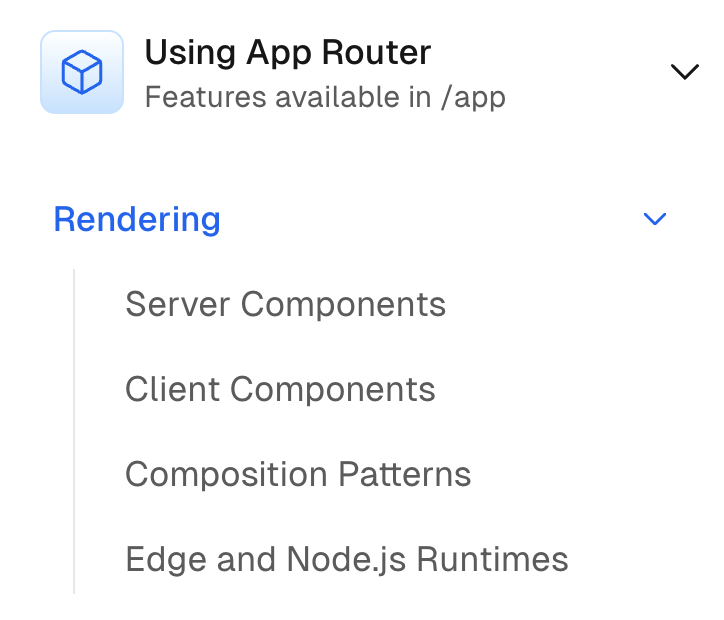

## 목차

- [Next.js의 SSR은 무엇을 위해 존재하는가?](#nextjs의-ssr은-무엇을-위해-존재하는가)
- [Next App Router와 Pages Router의 렌더링 방식은 어떻게 다른가?](#next-app-router와-pages-router의-렌더링-방식은-어떻게-다른가)
  - [Pages Router에서 App Router으로의 전환 맥락](#pages-router에서-app-router으로의-전환-맥락)
  - [Next v12와 v13의 React PeerDependency 버전 비교](#next-v12와-v13의-react-peerdependency-버전-비교)
  - [App Router의 Rendering](#app-router의-rendering)
  - [Recap](#recap)
- [Reference](#reference)

## UX 관점에서 바라본 Nextjs의 SSR

UI 라이브러리의 핵심은 유저의 사용 경험 증진이고, React 커뮤니티는 당연하게도 UX를 높히는 방향으로 발전하고 있다. UX를 높이는 방향에서, 가장 중요한 요소 중 하나는 **'유저가 얼마나 빨리 화면을 보고 상호작용 할 수 있는가'** 이다. 결국 React 커뮤니티에서 코어하게 발전되고 있는 대부분의 요소들은 위 목표로 귀결된다.

Nextjs의 SSR도 같은 맥락에서 **'유저가 얼마나 빨리 화면을 보고 상호작용 할 수 있는가'** 이라는 목표를 공유한다.

원래 React는 CSR(Client Side Rendering)으로 동작한다. 따라서 SSR을 수행하기 위해서는 Express와 같은 server위에 React의 [**Server React DOM API**](https://ko.react.dev/reference/react-dom/server)를 사용하여 렌더링 서버를 자체 구축하거나, Next나 Remix와 같은 React Meta Framework를 통해 가능하다.

> 참고로 Next, Remix 등의 프레임워크도 내부적으로는 React의 Server React DOM API를 사용한다.

보통 직접 SSR 환경을 구축해서 사용하는 경우보다는, **Next, Remix 등의 프레임워크를 사용하는 경우가 많다**. 그럼 일단 Next Docs에서 말하는 SSR을 살펴보자.

> If a page uses Server-side Rendering, the page HTML is generated on each request.
>
> [Nextjs Docs | Server-side Rendering (SSR)](https://nextjs.org/docs/pages/building-your-application/rendering/server-side-rendering)

Nextjs Docs에서는 SSR를 사용하면, **각 요청마다 HTML 페이지가 생성**된다고 이야기한다.

그럼, React의 CSR과 Nextjs Page Router의 SSR은 UX적으로 어떤 부분에서 달라질까?

### Pure React CSR과 Nextjs Page Router SSR의 렌더링 동작 방식 차이

React와 Next의 동작 방식 차이를 생각해보면, 유저가 웹 사이트에 접근했을 때 UX의 차이도 자연스럽게 유추할 수 있다.

 **Pure React**는 먼저 아주 가벼운 HTML을 받아서, **전체 웹사이트를 렌더링할 수 있는 JS Bundle**를 요청해서 받아온다.

 **Next**는 각 요청마다, 해당 페이지의 HTML을 React Component로부터 렌더링해서 보낸다. 이후 필요한 js chunk들은 hydration되어 웹사이트가 interactive하게 된다.

그럼  **Pure React**는 **JS Bundle을 받아서 동적으로 어플리케이션 전체의 HTML을 생성하기 전까지 유저는 화면을 볼 수 없고**,  **Next**는 **현재 접근하려는 페이지에 대한 HTML과 해당 페이지의 JS Chunk를 받아오는 즉시 화면을 볼 수 있다**는 차이가 있다.

장단점을 조금 정리해보자면,  **Pure React**는 일단 JS Bundle을 받아오기만하면, 다른 Path로 Routing할 때 새롭게 HTML이나 JS를 요청하지 않고서, 동적으로 그릴 수 있다.
즉, **첫 페이지 접근에 대한 로딩은 상대적으로 느리지만 그 이후부터는 상대적으로 빠를 수 있다.**

반면,  **Next**는 Page 단위로 HTML과 JS Chunk를 요청하기 때문에, 하나의 페이지에 첫 번째 접근할 때는 빠르지만, 다른 페이지로 Routing할 때는 결국 서버와의 통신을 통해 다시 HTML과 JS chunk를 받아와야 하기 때문에, **첫 페이지 접근에 대한 로딩은 빠르지만 그 다음 navigation 과정에서는 상대적으로 느릴 수 있다.**

### (참고) Pure React / Nextjs 각각의 단점 극복하기

지금은 너무 단편적으로 설명했는데, [Code Splitting과 lazy loading](https://www.nextree.io/code-splitting/)으로 **Pure React** 환경에서도 **페이지별로 필요한 JS 파일만 불러올 수 있다.** 이를 통해, **첫 로딩이 느리다는 단점을 일부 극복**할 수 있다.

또, **Next** 환경에서도 `<Link />` 컴포넌트를 사용하는 경우, **pre-fetching**을 통해 **미리 다른 페이지에서 필요한 파일**을 가져올 수 있다. 이 경우에는, 다른 페이지를 이동하는 시점 이전에 미리 페이지를 요청해서 받아두기 때문에, **페이지 간 이동이 느리다는 단점을 일부 극복**할 수 있다.

그래서 최적화하기에 따라서 위 명제는 이야기가 조금 달라질 수도 있다. 하지만 일반적으로, **SSR의 경우 CSR보다 일단 유저가 초기 화면을 보게 되는 시간 자체가 빨라진다는 장점**이 있다.

### 웹 성능 지표로 바라본 CSR과 SSR의 차이

### App Router로의 전환 맥락과 의미

#### Pages Router에서 App Router로

일단 [Next **v13.0**에서는 app router 방식은 production 환경에서는, Vercel 측에서 사용하지 않을 것을 권장](https://nextjs.org/blog/next-13#new-app-directory-beta)했다.
그러나 [**v13.4** 이후부터는 **app router가 stable** 되었다](https://nextjs.org/blog/next-13-4#nextjs-app-router)고 이야기하며, 적극적으로 app router를 밀고 있는 추세이다.

[Nextjs Blog의 App router](https://nextjs.org/blog/june-2023-update)를 소개하는 글을 살펴보면, 다음과 같은 맥락에서 App Router를 설명한다.

> **Growing Beyond the Pages Router by Aligning with React**
>
> Most notably, the Next.js Pages Router was not designed for streaming, a cornerstone primitive in modern React, that helps us address the limitations we were facing and realize our long-term vision for Next.js.
>
> Making **streaming-friendly** framework APIs for data fetching, asset loading, and page metadata, as well as taking advantage of React's newer primitives required large changes to the core architecture of Next.js.
>
> We took the opportunity to build on top of the latest **React concurrent features**, like **Server Components, Suspense** and more, which have been designed for **streaming architectures**.
>
> [Next Blog | Growing Beyond the Pages Router by Aligning with React](https://nextjs.org/blog/june-2023-update#growing-beyond-the-pages-router-by-aligning-with-react)

위 내용을 기반으로 파악한 Nextjs의 **Page Router에서 App Router로의 전환** 맥락은, **React v18의 Concurrent Feature**에 영향을 많이 받은 것으로 보인다.

Nextjs 팀은, **Page Router**는 이러한 **최신 React의 Streaming** 방식을 반영하기에 적합한 아키텍처가 아니라고 판단한 것 같아 보인다. 그래서 **Page Router**를 계속 지원함과 동시에, **App Router**라는 구조를 새롭게 지원하면서 **React의 Streaming 방식을 반영하는 아키텍처를 적용**하려는 시도를 하고 있는 것 같다.

이 과정에서 하위 호환에 대한 측면에서도 많은 고민이 있었을 것으로 생각한다. 거의 6년간 고수해온 Pages Router를 놓아주는 것은 아무래도 **React v18**에서 변화한 많은 부분들을 이번 **app router**를 기점으로 새롭게 개편하여 반영하겠다는 의지로 보인다.

결국 React의 Meta Framework인 Next는 장기적으로 **React의 비전과 align**할 수 있는 방향으로 나아가야 한다고 생각할텐데, **Page Router에서는 해당 비전을 반영하기에 한계**를 느낀 것으로 보인다.

> As we saw increased adoption and larger scale applications being built with Next.js, we received feedback from the community and identified areas where we started to reach the limits of the Pages Router.
>
> [Next Blog | Growing Beyond the Pages Router by Aligning with React](https://nextjs.org/blog/june-2023-update#growing-beyond-the-pages-router-by-aligning-with-react) 중

#### Next v12와 v13의 React PeerDependency 버전 비교

> **[Next v12.2.6](https://www.npmjs.com/package/next/v/12.2.6?activeTab=code) - React [v17.0.2](https://github.com/facebook/react/blob/main/CHANGELOG.md#1702-march-22-2021) 이상 호환 가능**
>
> 
>
> 

> **[Next v13.0.1](https://www.npmjs.com/package/next/v/13.0.1?activeTab=code) - React [v18.2.0](https://github.com/facebook/react/blob/main/CHANGELOG.md#1820-june-14-2022) 이상 호환 가능**
>
> 
>
> 

위와 같이, **Next v13** 이전까지는 **React** `v17.0.2` 이상이면 호환 가능했던 것과 달리, **v13** 이후부터는 `v18.2.0` 이상부터 호환이 가능한 것을 살펴볼 수 있다.

결국 **v13**에서 가장 큰 변화인 **app router**는 **React v18**에서 도입된 **concurrent feature**들을 지원하고, **streaming** 방식의 **React**를 support하기 위한 움직임이라고 생각해도 큰 무리는 아니라고 본다.

#### App Router의 Rendering

> [**Next Docs의 Rendering Tab - Pages Router**](https://nextjs.org/docs/pages/building-your-application/rendering)
>
> 

> [**Next Docs의 Rendering Tab - App Router**](https://nextjs.org/docs/app/building-your-application/rendering)
>
> 

위 캡처본을 보면, **Pages Router**에서는 **SSR, SSG, CSR** 등 우리가 지금껏 이야기했던 **렌더링 방식들에 대해 직접적**으로 언급한다. 하지만, **App Router**의 Docs에서는 Rendering 탭에 우리가 익히 아는 내용이 아니라, **server component와 client component**를 이야기한다.

> [**Next Docs | Server Components**](https://nextjs.org/docs/app/building-your-application/rendering/server-components)
>
> 

**App Router**의 **server component** 설명을 보면, 3개의 **server rendering** 전략으로 `Static Rendering`, `Dynamic Rendering`, `Streaming`을 이야기한다.

이렇게 단어 선택 자체를 바꾼 것의 의미를 추측해보자면, **Server Side Rendering**이 아니라 **Server Rendering**이라고 말한 것부터 매우 의도적이라고 본다.

단순히 우리가 익히 알고 있는 **SSR(매 요청 시 마다 HTML을 렌더링하여 응답) 개념과는 다른 방식**이라고 말하고 싶은 의도로 보인다. 그리고 `Static Rendering`, `Dynamic Rendering`, `Streaming` 이라는 3가지 방식을 모두 **Server Rendering**이라는 범주에 묶으면서, **서버에서 렌더링을 수행한다는 것의 의미를 확장**하고자 하는 것처럼 느껴진다.

각 렌더링 방식에 대한 자세한 내용은 추후에 다른 포스트에서 다루도록 하겠다.

#### Recap

Next `v13`에서 **officially stable 된 app router**는 최신 React의 **concurrent features(Server Components, Suspense 등)**을 더 잘 지원하기 위해서 등장했다.

기존의 Pages Router의 구조로는 한계를 느끼고, App Router를 통해 **Streaming** 방식의 렌더링을 지원하려는 것이다. 그래서 기존에 존재하는 렌더링 방식과 개념들도, 이번 변화에 의해서 새롭게 정의되었다.

그렇다면 정말 App Router의 등장으로 기존에 풀기 어려웠던 어떤 문제들이 실질적으로 해결되었는지 살펴보자.

## Next App Router가 해결하고자 하는 문제

#### Page Router의 Server Side Rendering의 한계

Nextjs Page Router를 사용하여 [getServerSideProps API](https://nextjs.org/docs/pages/api-reference/functions/get-server-side-props)를 사용하는 경우 우리는 아래처럼 코드를 작성한다.

```tsx
import type { InferGetServerSidePropsType, GetServerSideProps } from "next"

type Repo = {
  name: string
  stargazers_count: number
}

export const getServerSideProps = (async () => {
  // Fetch data from external API
  const res = await fetch("https://api.github.com/repos/vercel/next.js")
  const repo: Repo = await res.json()
  // Pass data to the page via props
  return { props: { repo } }
}) satisfies GetServerSideProps<{ repo: Repo }>

export default function Page({
  repo,
}: InferGetServerSidePropsType<typeof getServerSideProps>) {
  return (
    <main>
      <p>{repo.stargazers_count}</p>
    </main>
  )
}
```

이러한 getServerSideProps API 인터페이스에서는 **Page** 단위로 SSR이 수행된다.

바로 이 지점이 **Page Router의 Server Side Rendering의 한계**로, 페이지 단위보다 더 작은 단위로 렌더링 방식을 결정하는 것이 어렵다는 것이다.

사실 React server component 등장 이전에는, 위와 같은 한계가 존재한다해도 React 자체에서 이러한 한계를 뛰어 넘을 수 있는 방법이 없었다. 그런데 React server component가 등장하면서, React의 컴포넌트를 서버와 클라이언트 중 어디에서 렌더링할지 결정하는 것이 가능해졌다.

그럼 이제는 더 이상 Page 단위에서만 SSR을 수행하는 것이 아니라, 컴포넌트 단위로 렌더링 방식을 결정할 수 있는 방식을 도입할 수 있게 된 것이다.

#### Page Router를 버려야 했던 맥락 생각해보기

그렇다면 위 내용처럼 컴포넌트 단위로 서버에서 React Component의 렌더링을 수행하기 위해서는, Page Router의 구조가 불충분했던 것일까?

#### App Router와 Server Component

## Reference

[What is server-side rendering in Next.JS? Pros and Cons | Marny Lopez - January 2023](https://www.devlane.com/blog/what-is-server-side-rendering-in-next-js-pros-and-cons)

[How the Google Search Algorithm Works | By Bill Widmer - Reviewed by Joshua Hardwick - April 4, 2022](https://ahrefs.com/blog/google-search-algorithm/)

[6 Next JS Tips To Improve The UX Of Your Application | Ala Ben Aicha - 2022년 3월 14일](https://www.linkedin.com/pulse/6-next-js-tips-improve-ux-your-application-ala-ben-aicha/)

[How to fix layout shifts to improve SEO in Next.js apps | Vilva Athiban P B - Mar 26, 2021](https://blog.logrocket.com/fix-layout-shifts-improve-seo-next-js/)

[Understanding React Server Components | Alice Alexandra Moore - August 1st 2023](https://vercel.com/blog/understanding-react-server-components)

[React 서버 컴포넌트 작동원리를 아주 쉽게 알아보자](https://blog.kmong.com/react-server-component%EB%A1%9C-%ED%94%84%EB%A1%A0%ED%8A%B8%EC%97%94%EB%93%9C-%EA%B0%9C%EB%B0%9C-%ED%98%81%EC%8B%A0%ED%95%98%EA%B8%B0-part-2-5cf0bf4416b0)

[Nextjs Blog | Next.js 13.4](https://nextjs.org/blog/next-13-4#nextjs-app-router)

[Nextjs Blog | Next.js 13](https://nextjs.org/blog/next-13#server-components)

[Nextjs Docs | Server Components](https://nextjs.org/docs/app/building-your-application/rendering/server-components)

[Nextjs Docs | What is streaming?](https://vercel.com/docs/fundamentals/what-is-streaming)
