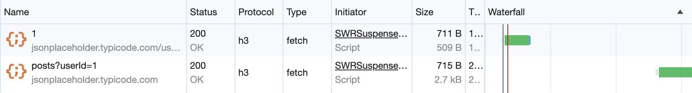
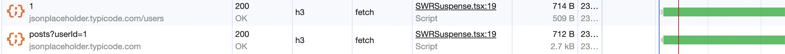
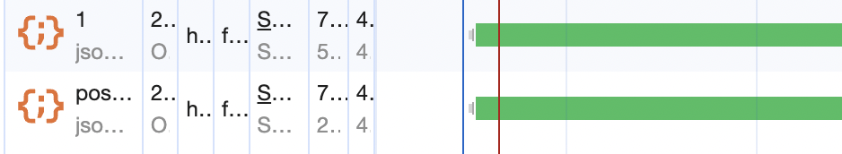
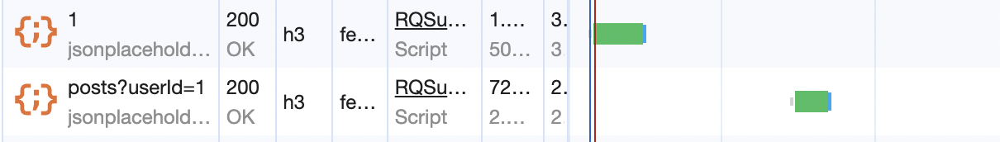
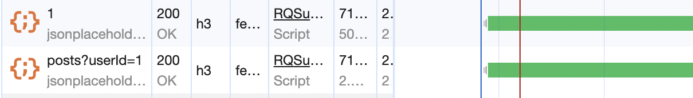
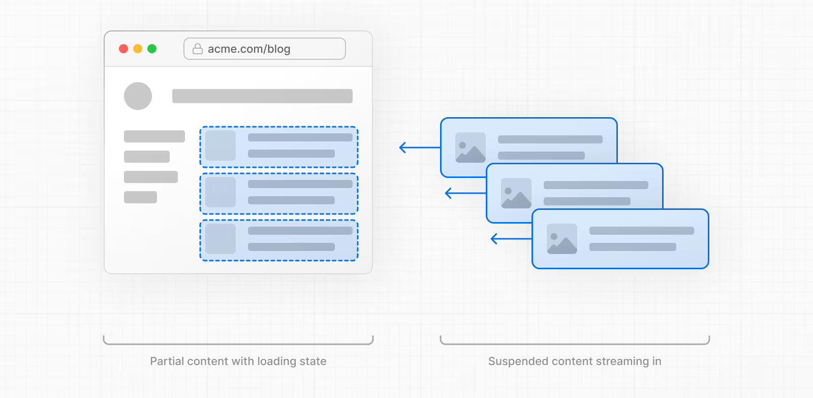

## 목차

- [React Suspense가 등장한 배경](#react-suspense가-등장한-배경)
- [So, Suspense로 무엇을 할 수 있는가?](#so-suspense로-무엇을-할-수-있는가)
  - [Contents를 로딩하는 동안 Fallback 표시하기](#contents를-로딩하는-동안-fallback-표시하기)
- [Suspense-enabled data source](#suspense-enabled-data-source)
- [Suspense-enabled framework](#suspense-enabled-framework)
  - [React-query](#react-query)
  - [SWR](#swr)
    - [SWR과 React-query에서 suspense 사용시 발생하는 waterfall 문제와 해결방법](#swr과-react-query에서-suspense-사용시-발생하는-waterfall-문제와-해결방법)
  - [Redux & RTK-query](#redux--rtk-query)
  - [Relay](#relay)
  - [Next.js](#nextjs)
    - [loading.js 파일로, 특정 페이지에 Suspense 기능 적용하기](#loadingjs-파일로-특정-페이지에-suspense-기능-적용하기)
    - [Streaming With Suspense](#streaming-with-suspense)
  - [라이브러리 없이 사용하기](#라이브러리-없이-사용하기)
- [Reference](#reference)

## React Suspense가 등장한 배경

[직전 포스트](../why-suspense)에서 살펴보았듯이, React `v18`에서 도입된 `concurrent feature`들은 기본적으로 **React의 렌더링 과정을 더 정교하게 설계할 수 있도록 옵션을 준 것**이라고 생각할 수 있다.

그 `concurrent feature`들 중 `Suspense`는 개발자가 `Suspense` 경계를 직접 나누면서, **비동기 데이터가 준비되고 있는 동안에는 해당 컴포넌트가 중단(Suspensed)되고, 실제로 데이터가 로드되었을 때 해당 컴포넌트를 렌더링**한다.

`Suspense`의 등장 배경에 대한 자세한 내용은 직전 포스트 [React Suspense는 왜 등장했나](../why-suspense)에서 살펴볼 수 있다. 해당 포스트에서는 `Suspense`가 어떤 맥락에서 등장했고, 왜 필요한지에 대해 알아 볼 수 있다.

---

## So, Suspense로 무엇을 할 수 있는가?

이제는 `Suspense`로 우리가 어떻게 **사용자 경험(UX)** 을 더 높일 수 있는지, **어떻게 코드에 적용할 수 있는지** 알아볼 차례이다.

### Contents를 로딩하는 동안 Fallback 표시하기

먼저, `<Suspense/>` 컴포넌트로 감싸지는 곳은 쉽게 이야기하면, **컴포넌트 준비 상태**에 따라서 바뀌는 렌더링에 대한 처리를 적용하는 **경계 구간**이다.

이 `<Suspense/>` 컴포넌트는 크게 두개의 요소를 필요로 한다.

첫째로, **렌더링하려는 실제 UI 컴포넌트** 그리고 둘째로, **로딩 상태일 때 노출할 Fallback**이다.

```jsx
<Suspense fallback={<Loading />}>
  <Albums />
</Suspense>
```

위와 같이, **렌더링 대상 컴포넌트**를 `<Suspense/>` 컴포넌트로 감싸주고, **로딩시에 보여줄 컴포넌트를 fallback**에 넣어주면 끝이다.

React는 `Suspense`로 감싸진 자식 컴포넌트의 모든 코드와 데이터가 **로드될 때까지 fallback**을 보여준다.

아래는 React 공식문서의 예제이다.

`ArtistPage.js`

```jsx
import { Suspense } from "react"
import Albums from "./Albums.js"

export default function ArtistPage({ artist }) {
  return (
    <>
      <h1>{artist.name}</h1>
      <Suspense fallback={<Loading />}>
        <Albums artistId={artist.id} />
      </Suspense>
    </>
  )
}

function Loading() {
  return <h2>🌀 Loading...</h2>
}
```

`ArtistPage`는 `Albums` 컴포넌트에 `Suspense` 경계를 걸어두고, **fallback**으로 `Loading` 컴포넌트를 설정해두었다. 이렇게, `Suspense`를 적용하는 곳에서는 크게 어렵지 않게 사용할 수 있다.

## Suspense-enabled data source

이제 여기서 가질 수 있는 의문점 하나가 생긴다.

**Suspense 경계 내부에 있는 모든 컴포넌트의 비동기 데이터 소스로 부터의 준비 상태는 React가 자동으로 인식하는 것일까?**

결론부터 말하자면, **그렇지 않다.** React 공식 문서에 따르면, <u>"**오직 Suspense-enalbed data sources만 Suspense 컴포넌트를 활성화 할 수 있다**"</u>고 말한다.

> Only Suspense-enabled data sources will activate the Suspense component. They include:
>
> - Data fetching with Suspense-enabled frameworks like Relay and Next.js
> - Lazy-loading component code with lazy
> - Reading the value of a cached Promise with `use`
>
> Suspense does not detect when data is fetched inside an Effect or event handler.
>
> The exact way you would load data in the Albums component above depends on your framework. If you use a Suspense-enabled framework, you’ll find the details in its data fetching documentation.
>
> Suspense-enabled data fetching without the use of an opinionated framework is not yet supported. The requirements for implementing a Suspense-enabled data source are unstable and undocumented. An official API for integrating data sources with Suspense will be released in a future version of React.
>
> [React Suspense 공식 문서](https://ko.react.dev/reference/react/Suspense)

공식 문서에 따르면, '**Relay나 Next와 같은 Suspense-enabled 프레임워크에서의 Data fetching**', '**lazy를 사용한 Lazy-loading 컴포넌트**', '**`use`를 사용해서 캐시된 Promise 값을 읽는 상황**'에서 `Suspense`를 사용할 수 있다고 한다.

그리고 `Suspense`는 **Effect**나 **Event Handler** 내부에서의 **fetching**은 감지하지 않는다고 한다.

React와 관련된 **유명 라이브러리 또는 프레임워크**를 사용하여 `Suspense`를 도입하는 방법 외에는 아직 정식으로 지원하고 있는 바는 없는 것으로 보인다.

그럼 **라이브러리의 도움**을 받아서 **React** `Suspense`를 도입하는 방법들을 알아보자.

**비동기 데이터**를 저장하는 스토어로 사용하는 **전역 상태 관리 라이브러리**나 **비동기 데이터 캐싱 및 관리 라이브러리**들 중 주로 많이 사용하는 것들을 비교해보자.

---

## Suspense-enabled framework

### React-query

[React Query v5 Docs - Suspense](https://tanstack.com/query/latest/docs/react/guides/suspense)를 참고해보면, `Suspense`를 공식적으로 지원한다.

[React Query v4 Docs - Suspense](https://tanstack.com/query/v4/docs/react/guides/suspense)와 같이, `v4`에서는 `experimental`이었지만 `v5`에서는 공식으로 지원하는 것으로 보인다.

> NOTE: `Suspense mode` for **React Query** is `experimental`, same as Suspense for data fetching itself. These APIs WILL change and should not be used in production unless you lock both your React and React Query versions to patch-level versions that are compatible with each other.
>
> React Query `v4` Docs - Suspense

특히 사용법의 차이가 있다.

`v4`

```jsx
// Configure for all queries
import { QueryClient, QueryClientProvider } from "@tanstack/react-query"

const queryClient = new QueryClient({
  defaultOptions: {
    queries: {
      suspense: true,
    },
  },
})

function Root() {
  return (
    <QueryClientProvider client={queryClient}>
      <App />
    </QueryClientProvider>
  )
}
```

```jsx
import { useQuery } from "@tanstack/react-query"

// Enable for an individual query
useQuery({ queryKey, queryFn, suspense: true })
```

`v5`

```jsx
import { useSuspenseQuery } from "@tanstack/react-query"

const { data } = useSuspenseQuery({ queryKey, queryFn })
```

`react-query`를 사용하고 있다면, 버전에 따라서 사용 방법이 다르니 위 코드를 참고해서 적용하면 좋다.

`v4`에서 `v5`로 넘어가면서, `Suspense` option을 켜는 방식에서 아예 기본 `useQuery`, `useInfiniteQuery`, `useSuspenseQueries`를 **wrapping**한 `useSuspenseQuery`, `useSuspenseInfiniteQuery`, `useSuspenseQueries`를 사용하도록 바뀌었다.

`suspense for react-query 소스 코드`

```jsx
'use client'
import { QueryObserver } from '@tanstack/query-core'
import { useBaseQuery } from './useBaseQuery'
import { defaultThrowOnError } from './suspense'
import type { UseSuspenseQueryOptions, UseSuspenseQueryResult } from './types'
import type { DefaultError, QueryClient, QueryKey } from '@tanstack/query-core'

export function useSuspenseQuery<
  TQueryFnData = unknown,
  TError = DefaultError,
  TData = TQueryFnData,
  TQueryKey extends QueryKey = QueryKey,
>(
  options: UseSuspenseQueryOptions<TQueryFnData, TError, TData, TQueryKey>,
  queryClient?: QueryClient,
): UseSuspenseQueryResult<TData, TError> {
  return useBaseQuery(
    {
      ...options,
      enabled: true,
      suspense: true,
      throwOnError: defaultThrowOnError,
    },
    QueryObserver,
    queryClient,
  ) as UseSuspenseQueryResult<TData, TError>
}
```

[github - react-query | useSuspenseQuery 소스코드](https://github.com/TanStack/query/blob/main/packages/react-query/src/useSuspenseQuery.ts)를 살펴보면, 실제로 `baseQuery`에서 `suspense` 옵션을 켜주는 정도로 단순히 기존 `useQuery`를 **wrapping** 한 모습이다. `Suspense`를 더 명시적으로 사용하기 위해서 **새로운 훅**으로 만든 것으로 보인다.

---

### SWR

[SWR Docs - Suspense](https://swr.vercel.app/ko/docs/suspense)를 참고하면, `swr`에서 `Suspense`를 사용하는 것을 권장하지는 않는 것으로 보인다.

> React still **doesn't recommend** using `Suspense` in data frameworks like **SWR** (More information). These APIs may change in the future as the results of our research.
>
> SWR Docs - Suspense

```jsx
import { Suspense } from "react"
import useSWR from "swr"

function Profile() {
  const { data } = useSWR("/api/user", fetcher, { suspense: true })
  return <div>hello, {data.name}</div>
}

function App() {
  return (
    <Suspense fallback={<div>loading...</div>}>
      <Profile />
    </Suspense>
  )
}
```

그래도 위 코드처럼, `useSWR` 훅을 사용하면서 **option** 인자에 `suspense` 옵션을 토글할 수 있도록 API를 제공하고 있다.

> Suspense mode suspends rendering until the data is ready, which means it causes waterfall problems easily. To avoid that, you should prefetch resources before rendering. [More information](https://swr.vercel.app/docs/prefetching)
>
> (ko) Suspense 모드는 data가 준비 상태가 될 때까지 렌더링을 중단하고, 이는 waterfall 문제를 쉽게 야기할 수 있다. 이 문제를 피하기 위해서는, 렌더링 이전에 resources를 prefetch 해야 한다.
>
> SWR Docs - Suspense

위 처럼 **SWR** 문서에서는 `Suspense`를 사용했을 때, 일어날 수 있는 문제인 **waterfall**에 대해 해결방법을 제시하고 있다.

#### SWR과 React-query에서 suspense 사용시 발생하는 waterfall 문제와 해결방법

**waterfall** 문제에 대해 설명해보자. 컴포넌트에서 *여러 쿼리*를 사용하고 **이 쿼리가 로딩 상태일때마다 fallback 컴포넌트로 대체**되면서, 이 **컴포넌트의 렌더링이 중단**되고 그 다음 **쿼리들이 작동을 시작하지 않게** 된다.

즉, 3개의 쿼리가 있다면, 1번째 쿼리가 완료되어야 비로소 2번째 쿼리를 요청하게 되는 것이다.

아래 예제를 보자.

```jsx
import { Suspense } from "react"
import useSWR from "swr"

function SWRSuspenseExampleComponent() {
  return (
    <div>
      <div>SWR Suspense Example</div>
      <Suspense fallback={<div>Loading...</div>}>
        <Profile />
      </Suspense>
    </div>
  )
}

export default SWRSuspenseExampleComponent
```

위 처럼 `Suspense`로 감싸진 `<Profile/>` 컴포넌트가 있다.

```jsx
const slowFetcher = async (url: string) => {
  const startTime = Date.now()
  const response = await fetch(url)
  // Simulate a slow response
  await new Promise(resolve => setTimeout(resolve, 1000))
  const data = await response.json()
  return { data, startTime }
}

function Profile() {
  const { data: user } = useSWR(
    "https://jsonplaceholder.typicode.com/users/1",
    slowFetcher,
    { suspense: true }
  )

  const { data: posts } = useSWR(
    "https://jsonplaceholder.typicode.com/posts?userId=1",
    slowFetcher,
    { suspense: true }
  )

  return (
    <div>
      <div>
        data : {user?.data?.name} fetch startTime : {user?.startTime}
      </div>
      <div>
        {posts?.data?.length} fetch startTime : {posts?.startTime}
      </div>
    </div>
  )
}
```

그리고 `<Profile/>` 컴포넌트는 위와 같이 **2개의 data source**에 **API 요청**을 보낸다. 두 요청 모두 **SWR**의 **suspense** 옵션을 켜두었기 때문에, **Suspense-enabled data source**이다.

이때, 가장 이상적인 동작은 **두 데이터 요청을 병렬적으로 처리**하여 `<Profile/>` 컴포넌트의 **data를 준비**시키는 것이다.

하지만, 실제로는 그렇게 동작하지 않는다.



위 캡처본은 각 **resourece** 별로, 브라우저 개발자 도구의 **네트워크 탭의 waterfall** 표이다. **첫번째 API**에 대한 **요청이 완료**되어야만, **다음 API**에 대한 **요청을 시작**하게 되는 모습이다.

이 문제는 **첫번째 API 요청**이 `suspense` 상태를 **trigger**해서, **해당 컴포넌트의 렌더링을 중단**시키기 때문에 발생한다.

사실 원래는 `suspense` 기능을 사용하지 않으면, **SWR**이 **두 API 요쳥**을 **병렬적**으로 처리한다.

아래처럼, `suspense` 기능을 꺼보자.

```jsx
const { data: user } = useSWR(
  "https://jsonplaceholder.typicode.com/users/1",
  slowFetcher
  // { suspense: true }
)

const { data: posts } = useSWR(
  "https://jsonplaceholder.typicode.com/posts?userId=1",
  slowFetcher
  // { suspense: true }
)
```



그럼 위처럼, **1ms 차이로 거의 동시**에 두 리소스를 요청해서 받아온다.

결국, **SWR**에서 별다른 처리없이 `suspense`를 사용하면, **waterfall** 현상에 의해 발생하는 문제를 직면하게 된다.

[SWR Docs | prefetching data](https://swr.vercel.app/docs/prefetching)에서는 이 문제를 해결하기 위해, **data**를 **prefetching** 하기를 권장한다.

**3가지의 방법**이 있는데, `Top-level Page Data`, `Programmatically Prefetch`, `Pre-fill Data` 방식이 있다.

`Top-level Page Data`는 HTML <head>에서 **최상위 요청**에 대해 [**preload**](https://developer.mozilla.org/ko/docs/Web/HTML/Attributes/rel/preload)를 하는 것이다.

```html
<link rel="preload" href="/api/data" as="fetch" crossorigin="anonymous" />
```

위 코드를 <head> 태그 내에 넣어서, **javascript**가 다운로드 되기 전에 `rel="preload"`를 통해 **data**를 **prefetching** 할 수 있다. 이후 **동일한 URL로의 모든 요청은 결과를 재사용**하게 된다.

**SWR**도 마찬가지로 이 데이터를 **재사용**하게 된다.

하지만, 이 방법은 **특정 페이지에서 반드시 필요한 경우**에만 사용하는 것이 좋고, **preload**에 대해 잘 알지 못하고 사용하면, 예상하지 못한 방식으로 동작할 수 있다.

원래 **preload**는 **비즈니스 요구**에 따라, 빠르게 로드해야하는 특정 리소스를 위해서 사용하는 것이라서 단순히 **waterfall** 문제를 해결하기위해서 **모든 api 요청**을 **preload** 하는 것은 그다지 좋은 해결 방법은 아닌 것으로 보인다.

**Preload**에 대해 더 알고 싶다면, [Preload의 개념, 그리고 올바른 사용법 | Inyong - 2021.9.5](https://helloinyong.tistory.com/319)에서 잘 설명하고 있으니, 참고하자.

다른 방식으로는 `Programmatically Prefetch`가 있다.

개인적으로 이 방식으로, **SWR**에서 **prefetch**를 사용하는 것이 깔끔하게 문제를 해결하는 방식으로 보인다.

**SWR**의 `preload` API를 사용해서 아래와 같이 **프로그래밍 방식**으로 **resource**를 **prefetch**하는 것이 더 좋아보인다.

```jsx
import { useState } from 'react'
import useSWR, { preload } from 'swr'

const fetcher = (url) => fetch(url).then((res) => res.json())


// 아래 사용자 구성 요소를 렌더링하기 전에 리소스를 미리 로드합니다.
// 이는 waterfall 현상을 막을 수 있습니다.
// 버튼이나 링크를 호버할 때도 preload를 시작할 수 있습니다.
preload('/api/user', fetcher)

function User() {
  const { data } = useSWR('/api/user', fetcher)
  ...
}

export default function App() {
  const [show, setShow] = useState(false)
  return (
    <div>
      <button onClick={() => setShow(true)}>Show User</button>
      {show ? <User /> : null}
    </div>
  )
}
```

위처럼 **React** 외부에서 **preload**를 할 수도 있고, 아래처럼 **React** 내에서 **event handler**나 **effect**에서 **preload**를 할 수도 있다.

```jsx
function App({ userId }) {
  const [show, setShow] = useState(false)

  // effect에서의 preload
  useEffect(() => {
    preload('/api/user?id=' + userId, fetcher)
  }, [userId])

  return (
    <div>
      <button
        onClick={() => setShow(true)}
        {/* 이벤트 콜백에서의 preload */}
        onHover={() => preload('/api/user?id=' + userId, fetcher)}
      >
        Show User
      </button>
      {show ? <User /> : null}
    </div>
  )
}
```

또, **SWR**에서는 `Pre-fill Data` 기능을 사용할 수도 있다. 아래 코드처럼, fallbackData를 넣어두면, SWR 캐시에 데이터를 채워놓고 시작할 수 있다.

```jsx
useSWR("/api/data", fetcher, { fallbackData: prefetchedData })
```

이 경우에는 일단 SWR의 캐시에 데이터가 있기 때문에, suspense에 데이터가 이미 다 준비되었다고 알리게 된다.

그래서 아래와 같은 코드로 SWR을 사용하면, waterfall 현상 자체는 피할 수 있다.

```jsx
const { data: user } = useSWR(
  "https://jsonplaceholder.typicode.com/users/1",
  slowFetcher,
  {
    suspense: true,
    fallbackData: { data: { name: "fallback" }, startTime: 0 },
  }
)

const { data: posts } = useSWR(
  "https://jsonplaceholder.typicode.com/posts?userId=1",
  slowFetcher,
  { suspense: true, fallbackData: { data: [], startTime: 0 } }
)
```



하지만, 이렇게 하면 **suspense**에는 **데이터 준비 중이라는 상태를 갖는 순간이 존재하지 않는다.**

이 방식은 **suspense**를 사용하지 않고, **fallback** 데이터를 보여주는 방식을 구현할 때 사용할 수 있겠다.

즉, `Pre-fill Data`로는 `Suspense`에 의한 **waterfall**을 직접 해결할 수는 없다.

**SWR**에서는 `Programmatically Prefetch` 방식이 가장 괜찮아보이긴 하지만, 사실 [**React-query**의 경우 이 waterfall 문제](https://tanstack.com/query/latest/docs/react/guides/request-waterfalls)를 **더 쉬운 API**로 해결하는 것으로 보인다.

**React-query**에서도, `Suspense`를 사용할 때, 한 컴포넌트에서 발생하는 api 호출 **waterfall** 문제가 발생한다. 이를 해결하는 방법으로 `useQueries(v4)`, `useSuspenseQuries(v5)` 를 사용하면 된다.

`v5` 기준으로 설명해보자면, 아래와 같이 `useSuspenseQuery`로 **여러 resource에 접근**하는 코드는 **waterfall** 문제를 가질 수 있다.

```jsx
import {
  QueryClient,
  QueryClientProvider,
  useSuspenseQuery,
} from "@tanstack/react-query"
import { Suspense } from "react"

const queryClient = new QueryClient()

function RQSuspense() {
  return (
    <QueryClientProvider client={queryClient}>
      <div>
        <div>React-query Suspense Example</div>
        <Suspense fallback={<div>Loading...</div>}>
          <Profile />
        </Suspense>
      </div>
    </QueryClientProvider>
  )
}

export default RQSuspense

const slowFetcher = async (url: string) => {
  const startTime = Date.now()
  const response = await fetch(url)
  // Simulate a slow response
  await new Promise(resolve => setTimeout(resolve, 1000))
  const data = await response.json()
  return { data, startTime }
}

function Profile() {
  const { data: user } = useSuspenseQuery({
    queryKey: ["userData"],
    queryFn: () => slowFetcher("https://jsonplaceholder.typicode.com/users/1"),
  })

  const { data: posts } = useSuspenseQuery({
    queryKey: ["postsData"],
    queryFn: () =>
      slowFetcher("https://jsonplaceholder.typicode.com/posts?userId=1"),
  })

  return (
    <div>
      <div>
        data : {user?.data?.name} fetch startTime : {user?.startTime}
      </div>
      <div>
        {posts?.data?.length} fetch startTime : {posts?.startTime}
      </div>
    </div>
  )
}
```



위 코드의 문제를 해결하기 위해서, `useSuspenseQueries`로 여러 쿼리를 묶어 병렬적으로 처리할 수 있다.

```jsx
const [{ data: user }, { data: posts }] = useSuspenseQueries({
  queries: [
    {
      queryKey: ["userData"],
      queryFn: () =>
        slowFetcher("https://jsonplaceholder.typicode.com/users/1"),
    },
    {
      queryKey: ["postsData"],
      queryFn: () =>
        slowFetcher("https://jsonplaceholder.typicode.com/posts?userId=1"),
    },
  ],
})
```

위와 같이 `useSuspenseQueries`로 **queries**를 묶어서 요청하면, 아래와 같이 **waterfall** 문제를 해결할 수 있다.



---

### redux & rtk-query

**rtk-query**는 **react-query**나 **swr**처럼 **비동기 데이터 캐싱**을 지원하고, 사용법도 비슷하다.

하지만, [suspense와 관련된 공식문서](https://redux-toolkit.js.org/rtk-query/api/created-api/api-slice-utils#description-9)에서는 아직 `suspense`에 대한 **정식 지원을 하지 않는 것**으로 보인다.

> These thunks are primarily added **to add experimental support for suspense in the future.** They enable writing custom hooks that look up if RTK Query has already got a running query/mutation for a certain endpoint/argument combination, and retrieving that to throw it as a promise.
>
> [suspense와 관련된 rtk-query 공식문서](https://redux-toolkit.js.org/rtk-query/api/created-api/api-slice-utils#description-9)

[[open issue] Support for Suspense in RTK Query #1574](https://github.com/reduxjs/redux-toolkit/issues/1574)와 같은 open된 이슈나, [[open PR] feat: add useSuspendAll hook & react/suspense example #2245](https://github.com/reduxjs/redux-toolkit/pull/2245)와 같은 open된 PR을 살펴보면, suspense에 대응하는 API를 만들기 위해 시도한 흔적이 있다.

하지만 두 Issue와 PR 모두 2022년에 논의되었지만 아직도 Open된 상태로 방치되어있는 것으로 보아, **rtk-query**에서 **suspense에 대한 지원을 적극적으로 수행할 정도로 우선순위가 높아보이지 않는다.**

만약 **rtk-query**와 **suspense**를 사용하는 방법을 찾는다면, 이 부분은 업데이트하도록 하겠다.

현재로써 내가 찾아본 바로는, **suspense**를 위해 **rtk-query** library 자체에서 지원하는 **API는 아직 정식적으로 없는 것으로 보인다.**

---

### Relay

GraphQL 클라이언트 프레임워크인 Relay를 사용한다면, [Loading States with Suspense | Relay Docs](https://relay.dev/docs/guided-tour/rendering/loading-states/) 에서 자세한 내용을 확인할 수 있다.

Relay 와 관련된 내용은 따로 포스트를 작성할 예정이니, Relay에서도 suspense-enabled data source를 지원한다는 사실만 알고 넘어가자.

---

### Next.js

Next.js에서 제공하는 Suspense 관련 기능은 App Router 기준으로 설명하겠다.

[Loading UI and Streaming | Next.js Docs](https://nextjs.org/docs/app/building-your-application/routing/loading-ui-and-streaming) 를 살펴보면, 먼저 Next.js 프레임워크의 파일 라우팅 방식에서 특수하게 제공하는 Suspense 기능에 대한 내용이 있다.

#### loading.js 파일로, 특정 페이지에 Suspense 기능 적용하기


Next.js App Router 기준으로, 특정 페이지에 Suspense 기능을 적용하기 위해서는 `loading.js` 파일을 만들어서 사용할 수 있다.

이 파일은 특정 페이지에 대한 데이터를 로드하는 동안 보여줄 로딩 UI를 정의하는 파일이다.

실제로는 아래처럼 Page 를 `<Suspense>`로 감싼 것과 같은 동작을 한다.


> Recommendation: Use the loading.js convention for route segments (layouts and pages) as Next.js optimizes this functionality.
>
> [Next.js Docs | Loading UI and Streaming](https://nextjs.org/docs/app/building-your-application/routing/loading-ui-and-streaming#instant-loading-states)

Next.js 팀에서는 Next.js가 이 기능을 최적화하므로 Route Segment(Layouts 및 Pages)에는 `loading.js` 규칙을 사용하도록 권장하고 있다.

#### Streaming With Suspense

[Next.js Docs | Streaming With Suspense](https://nextjs.org/docs/app/building-your-application/routing/loading-ui-and-streaming#streaming-with-suspense) 를 참고하면, App Router 기준으로 Streaming 기능을 사용시에 Suspense를 사용할 수 있는 방법에 대해 알 수 있다.



위처럼 UI 컴포넌트 단위에서 Suspense와 함께 Streaming 기능을 사용할 수 있고, 자세한 내용은 위 공식문서를 참고하자.

---

### 라이브러리 없이 사용하기

React 공식문서에서는, <u>**Suspense-enabled framework를 사용하지 않고 Suspense를 사용하는 방법에 대해서는 현재 정식으로 지원하고 있지 않다.**</u>

Suspense enabled data source를 구현하기 위한 요구사항이 아직 명확하지 않고, 문서화되지 않았다고 말한다.

이번 React v19에서도 여전히 이 부분에 대한 문서화가 이루어지지 않았다. 그런데, **suspense-enabled data source**에 해당하는 항목이 하나 늘었는데, 이는 **'[use](https://ko.react.dev/reference/react/use) 를 사용해서 캐시된 Promise 값 읽기'** 도 **suspense-enabled data source**에 해당한다는 것이다.

이 부분에 대한 자세한 내용은 추후에 따로 포스트를 작성해서 공유하도록 하겠다.

---

## Suspense는 모든 비동기 데이터 소스에 대해서 자동으로 동작하지 않는다.

결론적으로, Suspense는 모든 비동기 데이터 소스에 대해서 자동으로 동작하지 않는다. React Suspense는 오직 **suspense-enabled data source**에 대해서만 동작한다.

그리고 이 데이터 소스는 공식적으로는 **1) suspense-enabled framework를 적용**하는 경우나 **2) lazy를 활용한 지연 로딩 컴포넌트**, **3) use를 사용해서 캐시된 Promise 값을 읽는 경우**에만 사용할 수 있다.

## Reference

0. [Suspense | react-ko 공식 문서](https://ko.react.dev/reference/react/Suspense)
1. [Suspense in React 18: How it works, and how you can use it - By Peter Kellner | October 09, 2022](https://www.pluralsight.com/blog/software-development/suspense-react-18-explained)
2. [Concurrent React - jay·2022년 8월 4일](https://velog.io/@jay/Concurrent-React)
3. [리액트 18의 신기능 - 동시성 렌더링(Concurrent Rendering), 자동 일괄 처리(Automatic Batching) 등 - 2023년 2월 23일 Translator: Jeong Won Yoo Author: Shruti Kapoor (English)](https://www.freecodecamp.org/korean/news/riaegteu-18yi-singineung-dongsiseong-rendeoring-concurrent-rendering-jadong-ilgwal-ceori-automatic-batching-deung/)
4. [리액트의 렌더링은 어떻게 일어나는가? | yceffort - 2022-04-09](https://yceffort.kr/2022/04/deep-dive-in-react-rendering)
5. [Understanding React Reconciliation in React 18: A Deep Dive](https://medium.com/@souviksen093/understanding-react-reconciliation-in-react-18-a-deep-dive-16b083e5592a)
6. [CSR 환경에서 Suspense로 발생한 문제 해결하고 성능 개선하기 | 카카오페이 블로그 - 2023. 11. 23](https://tech.kakaopay.com/post/react-router-dom-csr-prefetch/)
7. [Suspense for Data Fetching의 작동 원리와 컨셉 (feat.대수적 효과) | 김맥스 블로그](https://maxkim-j.github.io/posts/suspense-argibraic-effect/)
8. [Suspense와 선언적으로 Data fetching처리 | 카카오 엔터테인먼트 기술 블로그 - 2021.12.09](https://fe-developers.kakaoent.com/2021/211127-211209-suspense/)
9. [Suspense 도입과 Waterfall 현상 해결하기 | seungchan\_\_y - 2023년 2월 13일](https://velog.io/@seungchan__y/Suspense-%EB%8F%84%EC%9E%85%EA%B3%BC-Waterfall-%ED%98%84%EC%83%81-%ED%95%B4%EA%B2%B0%ED%95%98%EA%B8%B0)
