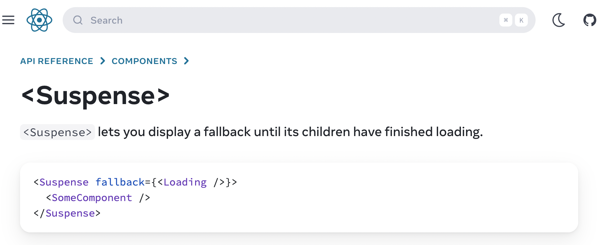

## 목차

- [React Suspense가 등장한 배경](#react-suspense가-등장한-배경)
  - [공식 문서에서 배경 읽어보기](#공식-문서에서-배경-읽어보기)
  - [Suspense 그 이전에 React Concurrent Feature부터](#suspense-그-이전에-react-concurrent-feature부터)
  - [React의 Rendering은 원래 멈출 수 없어](#react의-rendering은-원래-멈출-수-없어)
  - [React에서 렌더링이란?](#react에서-렌더링이란)
  - [다시 돌아와 Suspense는 왜 등장했나](#다시-돌아와-suspense는-왜-등장했나)
- [Reference](#reference)

## React Suspense가 등장한 배경

### 공식 문서에서 배경 읽어보기

가장 먼저, React Suspense가 등장한 배경을 알기 위해서 React 공식문서로 접근해본다.

[React Suspense 공식 문서](https://react.dev/reference/react/Suspense)

문서에서 Suspense를 검색해서 바로 보이는 화면은 아래와 같다.


`<Suspense>` 컴포넌트로, `<SomeComponent/>` 를 감싸고 있고,
`<Suspense>` 컴포넌트에는 **fallback**이라는 props에 `<Loading/>` 이라는 컴포넌트를 넣고 있다.

> EN) `<Suspense>` lets you display a fallback until its children have finished loading.

> KOR) `<Suspense>` 는 그 자식 컴포넌트가 로딩 상태가 종료될 때 까지 fallback을 보여주도록 한다.

이라고 말하며, Suspense의 역할과 기능을 소개한다.

그 외에는 딱히 어떤 배경에서 이 기능을 만들게 되었는지에 대해 설명해주는 단락이 보이지는 않는다.
단지, Suspense에 해당하는 공식 문서의 내용은 Suspense 자체에 대한 사용법과 안내사항들이 나열되어 있다.

그래서 따로 도입 배경을 찾아보기로 했다.

### Suspense 그 이전에 React Concurrent Feature부터

**Suspense**의 등장 배경을 이해하기 위해서는 기본적으로, React `v18`의 핵심인 **Concurrent Feature**에 대해 이해하고 있어야 한다.

React는 기본적으로 JS 위에서 동작하고, JS는 기본적으로 **single thread**로 동작한다. 그 말은 즉, **React는 기본적으로 렌더링 동작이 일어나고 있을 때 main thread를 점령**하게 되고, 이 때문에 **진행중인 작업이 다 완료**되어야지만, **user event**와 같은 **interaction**에 대한 작업을 수행할 수 있다.

이 부분은 당연하게도 사용자 경험에 악영향을 끼칠 수 있고, **web worker**를 활용하여 다른 thread를 사용하는 우회 방법도 있지만, 결국 <u>**React에서 렌더링의 우선순위를 유연하게 설계할 수 없다**</u>는 점은 분명한 한계였다.

**React Rendering** 과정의 문제점들을 해결하기 위해, React의 코어팀은 **async rendering**이라는 개념을 소개하더니, 이후 점차 발전시켜 **Concurrent Feature**를 `v18`부터 적극적으로 밀고 있다.

### React의 Rendering은 원래 멈출 수 없어

지금 이야기하는 **Concurrent Rendering**과는 달리, 기본적으로 따로 처리를 하지 않는다면, <u>**React의 Rendering은 한번 시작하면 중단할 수 없다.**</u>

별도로, **debounce**나 **throttle**과 같은 방법을 통해, 일정 시간 주기로 실행하거나 대기하도록 만드는 등의 방식으로 우회 전략을 세울 수도 있겠으나, 확실한 해결책은 될 수 없는 임시방편일 뿐이다.

**이 문제를 제대로 해결하려면, Rendering 과정에 관여하여,** **Rendering 중단과 재개를 개발자가 컨트롤** 할 수 있어야 한다.

그런데, `v17`에서 **Concurrent mode**를 opt-in으로 도입하기 시작하면서, 이제 React를 사용하는 개발자들에게 선택권이 주어지게 된다. ([React v17.0.0 릴리즈 노트 - concurrent mode](https://github.com/facebook/react/releases/tag/v17.0.0))

바로, 이제는 **React Rendering의 순서에 개입**할 수 있게 된 것이다.

React `v17`에서 `v18`로 넘어가면서, `Root`에서 `React App Component`를 렌더링하는 방식이 아래와 같이 바뀌었다.

`v17`

```jsx
import ReactDOM from "react-dom"
import App from "App"

const container = document.getElementById("app")

ReactDOM.render(<App />, container)
```

`v18`

```jsx
import ReactDOM from "react-dom"
import App from "App"

const container = document.getElementById("app")

const root = ReactDOM.createRoot(container)

root.render(<App />)
```

코드상의 차이는 크지 않지만, `createRoot`라는 새로운 API를 도입하면서, React `v18`의 기능에 접근할 수 있는 열쇠로 사용하였다.

`createRoot API`를 사용해야, `concurrent feature`를 사용할 수 있다.

### React에서 렌더링이란?

먼저 간단하게 **React가 렌더링되는 방식**을 짚고 넘어가보자.
사실 내부적으로 상당히 복잡하기 때문에, 이번 포스트에서는 간단히만 짚고 넘어가보겠다.

일단 [클래스 라이프 사이클 메소드 다이어그램](https://projects.wojtekmaj.pl/react-lifecycle-methods-diagram/)을 살펴보면, **라이프 사이클 메소드 다이어그램**을 확인할 수 있다. **React에서 렌더링과 관련된 라이프 사이클**을 확인할 수 있다.

[리액트의 렌더링은 어떻게 일어나는가?](https://yceffort.kr/2022/04/deep-dive-in-react-rendering)

위 글은 **React 렌더링** 과정을 정말 잘 정리해놓아서, 참고하면 좋다. 기본적으로 **React**는 **컴포넌트가 처음 마운트 될때**와 **state나 props에 변경사항이 발생**하면, **컴포넌트가 렌더링**된다.

> "리액트에서 렌더링이란, 컴포넌트가 현재 props와 state의 상태에 기초하여 UI를 어떻게 구성할지 컴포넌트에게 요청하는 작업을 의미한다."
>
> yceffort blog

위 인용구절처럼 결국 <u>**React는 props와 state가 변경되었을 때, 어떻게 UI에 보여줄 것인가에 초점이 맞추어져 있다.**</u>

간단히 설명하자면, **React**는 `Virtual DOM`이라는 자체적인 **DOM 자료구조**를 가지고 있다. 이것은 **브라우저의 DOM**과 매우 유사한 자료구조로, **React가 실제 DOM을 업데이트하는 과정을 최적화**하기 위한 **Buffer**처럼 작동한다.

이 `Virtual DOM`을 관리하기 위해서 **React**는 `Reconciliation`이라는 일련의 과정을 통해, **Virtual DOM과 기존의 Virtual DOM의 비교 작업을 수행하고, 변경사항을 Virtual DOM에 반영하는 과정**을 거친다.

이러한 렌더링 과정을 **React**에서는, 크게 `Render Phase`와 `Commit Phase`로 나눈다.

`Render Phase`에서는 **컴포넌트를 렌더링**하고, **변경 사항을 계산하는 작업을 수행**하고, `Commit Phase`는 **DOM에 변경사항을 적용**하는 과정을 수행한다.

이때, **계산된 모든 과정을 실제 DOM에 적용하는 과정**은 **동기 시퀀스로 수행**된다.

즉, <u>**기본적으로 React에서 렌더링과 이를 DOM에 적용하는 과정은 중단할 수 없다.**</u>

하지만, `Concurrent Feature` 또는 `Concurrent Mode`는 **렌더링을 일시 중지**하고, **렌더링을 다시 시작**한다거나 하는 등의 조작이 가능하다.

### 다시 돌아와 Suspense는 왜 등장했나

`Suspense`는 결국 위에서 한참 이야기했던 문제인 "**React는 개발자가 렌더링을 유연하게 설계할 수 없다**"는 것을 **해결하기 위한 도구 중 하나** 인 것이다.

`Suspense`는 React `v18`의 여러 **break change** 중 하나인 것이고, 사실 [React v16.6.0 체인지로그](https://github.com/facebook/react/blob/main/CHANGELOG.md#1660-october-23-2018)와 [React 소스코드 Github Commit - Remove unstable_prefix from Suspense #13922](https://github.com/facebook/react/pull/13922)를 보면, `v16.6.0`부터 **unstable** 딱지를 떼고 존재하던 기능이다.

물론, 당시의 `Suspense`는 지금의 `Suspense`와는 꽤나 차이가 있다. `v18` 이전에는 단순히 **JS 번들 코드**를 **Lazy Loading**하는데 쓰이는 것이었다. `v18`부터는 이러한 컨셉의 `Suspense`를 확장하여 **Data fetching**과 같은 **비동기 작업**도 `Suspense`에 적용할 수 있게 만들었다.

정리하자면, `Suspense`를 포함한 React `v18`의 `concurrent feature`들은 **React**를 사용하여 웹을 개발하는 개발자들이 <u>**React의 렌더링 과정을 더 정교하게 설계할 수 있도록 옵션을 준 것**</u>이라고 생각할 수 있다.

그 중 `Suspense`는 **비동기 데이터 요청**을 포함한 **컴포넌트가 준비되기까지 fallback**을 보여주는 것을 기본 기능으로, **stale 컨텐츠를 다루는 방식, 하위 컴포넌트의 준비 여부와 노출에 대한 결정 등에 관여**할 수 있게 도와준다.

`Suspense`는 **비동기 데이터 소스**를 통해 제어되고, `Suspense` 컴포넌트를 감싸는 방식으로 **그 경계를 세워두는 방식**으로 API를 제공한다. 개발자가 `Suspense` 경계를 직접 나누면서, <u>**비동기 데이터가 준비되고 있는 동안에는 해당 컴포넌트가 중단(Suspensed)되고, 실제로 데이터가 로드되었을 때 해당 컴포넌트를 렌더링**</u>한다.

즉, 이제 React를 사용하는 개발자는 **어떤 컴포넌트를 언제 렌더링 중단 및 시작시킬지를 정할 수 있는 것**이다. 특히 `Suspense` 기능을 통해서는 **비동기 데이터 요청의 완료 여부**를 기준으로 **렌더링을 중단하고 시작**할 수 있는 것이다.

결론적으로, `Suspense`는 <u>**React의 발전 흐름 상, 렌더링 과정을 컨트롤 할 수 있도록 만들어 주기위해서 나온 기능 중 하나**</u>이고, 특히 <u>**비동기 데이터 요청을 기준으로 한 렌더링 여부 처리를 개발자가 쉽게 컨트롤**</u>할 수 있도록 React에서 제공하는 기능인 것이라고 할 수 있다.

---

## So, Suspense로 무엇을 할 수 있는가?

`Suspense`가 어떤 맥락에서 등장했고, 왜 필요한지에 대해 조금 자세히 알아 볼 수 있었다.

이제는 `Suspense`로 우리가 어떻게 **사용자 경험(UX)** 을 더 높일 수 있는지, **어떻게 코드에 적용할 수 있는지** 알아볼 차례이다.

### Contents를 로딩하는 동안 Fallback 표시하기

먼저, `<Suspense/>` 컴포넌트로 감싸지는 곳은 쉽게 이야기하면, **컴포넌트 준비 상태**에 따라서 바뀌는 렌더링에 대한 처리를 적용하는 **경계 구간**이다.

이 `<Suspense/>` 컴포넌트는 크게 두개의 요소를 필요로 한다.

첫째로, **렌더링하려는 실제 UI 컴포넌트** 그리고 둘째로, **로딩 상태일 때 노출할 Fallback**이다.

바로 코드로 보자. 지금까지 잔뜩 이야기를 풀었지만, 코드는 간단하다.

```jsx
<Suspense fallback={<Loading />}>
  <Albums />
</Suspense>
```

위와 같이, **렌더링 대상 컴포넌트**를 `<Suspense/>` 컴포넌트로 감싸주고, **로딩시에 보여줄 컴포넌트를 fallback**에 넣어주면 끝이다.

React는 `Suspense`로 감싸진 자식 컴포넌트의 모든 코드와 데이터가 **로드될 때까지 fallback**을 보여준다.

아래는 React 공식문서의 예제이다.

`ArtistPage.js`

```jsx
import { Suspense } from "react"
import Albums from "./Albums.js"

export default function ArtistPage({ artist }) {
  return (
    <>
      <h1>{artist.name}</h1>
      <Suspense fallback={<Loading />}>
        <Albums artistId={artist.id} />
      </Suspense>
    </>
  )
}

function Loading() {
  return <h2>🌀 Loading...</h2>
}
```

`ArtistPage`는 `Albums` 컴포넌트에 `Suspense` 경계를 걸어두고, **fallback**으로 `Loading` 컴포넌트를 설정해두었다. 이렇게, `Suspense`를 적용하는 곳에서는 크게 어렵지 않게 사용할 수 있다.

### Suspense-enabled data source

이제 여기서 가질 수 있는 의문점 하나가 생긴다. **Suspense 경계 내부에 있는 모든 컴포넌트의 비동기 데이터 소스로 부터의 준비 상태는 React가 자동으로 인식하는 것일까?**

결론부터 말하자면, **그렇지 않다.** React 공식 문서에 따르면, <u>"**오직 Suspense-enalbed data sources만 Suspense 컴포넌트를 활성화 할 수 있다**"</u>고 말한다.

> Only Suspense-enabled data sources will activate the Suspense component. They include:
>
> - Data fetching with Suspense-enabled frameworks like Relay and Next.js
> - Lazy-loading component code with lazy
>
> Suspense does not detect when data is fetched inside an Effect or event handler.
>
> The exact way you would load data in the Albums component above depends on your framework. If you use a Suspense-enabled framework, you’ll find the details in its data fetching documentation.
>
> Suspense-enabled data fetching without the use of an opinionated framework is not yet supported. The requirements for implementing a Suspense-enabled data source are unstable and undocumented. An official API for integrating data sources with Suspense will be released in a future version of React.
>
> [React Suspense 공식 문서](https://react-ko.dev/reference/react/Suspense)

공식 문서에 따르면, '**Relay나 Next와 같은 Suspense-enabled 프레임워크에서의 Data fetching**' 또는 '**lazy를 사용한 Lazy-loading 컴포넌트**'에서 `Suspense`를 사용할 수 있다고 한다.

그리고 `Suspense`는 **Effect**나 **Event Handler** 내부에서의 **fetching**은 감지하지 않는다고 한다.

React와 관련된 **유명 라이브러리 또는 프레임워크**를 사용하여 `Suspense`를 도입하는 방법 외에는 아직 정식으로 지원하고 있는 바는 없는 것으로 보인다.

그럼 **라이브러리의 도움**을 받아서 **React** `Suspense`를 도입하는 방법들을 알아보자.

**비동기 데이터**를 저장하는 스토어로 사용하는 **전역 상태 관리 라이브러리**나 **비동기 데이터 캐싱 및 관리 라이브러리**들 중 주로 많이 사용하는 것들을 비교해보자.

#### React-query

[React Query v5 Docs - Suspense](https://tanstack.com/query/latest/docs/react/guides/suspense)를 참고해보면, `Suspense`를 공식적으로 지원한다.

[React Query v4 Docs - Suspense](https://tanstack.com/query/v4/docs/react/guides/suspense)와 같이, `v4`에서는 `experimental`이었지만 `v5`에서는 공식으로 지원하는 것으로 보인다.

> NOTE: `Suspense mode` for **React Query** is `experimental`, same as Suspense for data fetching itself. These APIs WILL change and should not be used in production unless you lock both your React and React Query versions to patch-level versions that are compatible with each other.
>
> React Query `v4` Docs - Suspense

특히 사용법의 차이가 있다.

`v4`

```jsx
// Configure for all queries
import { QueryClient, QueryClientProvider } from "@tanstack/react-query"

const queryClient = new QueryClient({
  defaultOptions: {
    queries: {
      suspense: true,
    },
  },
})

function Root() {
  return (
    <QueryClientProvider client={queryClient}>
      <App />
    </QueryClientProvider>
  )
}
```

```jsx
import { useQuery } from "@tanstack/react-query"

// Enable for an individual query
useQuery({ queryKey, queryFn, suspense: true })
```

`v5`

```jsx
import { useSuspenseQuery } from "@tanstack/react-query"

const { data } = useSuspenseQuery({ queryKey, queryFn })
```

`react-query`를 사용하고 있다면, 버전에 따라서 사용 방법이 다르니 위 코드를 참고해서 적용하면 좋다.

`v4`에서 `v5`로 넘어가면서, `Suspense` option을 켜는 방식에서 아예 기본 `useQuery`, `useInfiniteQuery`, `useSuspenseQueries`를 **wrapping**한 `useSuspenseQuery`, `useSuspenseInfiniteQuery`, `useSuspenseQueries`를 사용하도록 바뀌었다.

`suspense for react-query 소스 코드`

```jsx
'use client'
import { QueryObserver } from '@tanstack/query-core'
import { useBaseQuery } from './useBaseQuery'
import { defaultThrowOnError } from './suspense'
import type { UseSuspenseQueryOptions, UseSuspenseQueryResult } from './types'
import type { DefaultError, QueryClient, QueryKey } from '@tanstack/query-core'

export function useSuspenseQuery<
  TQueryFnData = unknown,
  TError = DefaultError,
  TData = TQueryFnData,
  TQueryKey extends QueryKey = QueryKey,
>(
  options: UseSuspenseQueryOptions<TQueryFnData, TError, TData, TQueryKey>,
  queryClient?: QueryClient,
): UseSuspenseQueryResult<TData, TError> {
  return useBaseQuery(
    {
      ...options,
      enabled: true,
      suspense: true,
      throwOnError: defaultThrowOnError,
    },
    QueryObserver,
    queryClient,
  ) as UseSuspenseQueryResult<TData, TError>
}
```

[github - react-query | useSuspenseQuery 소스코드](https://github.com/TanStack/query/blob/main/packages/react-query/src/useSuspenseQuery.ts)를 살펴보면, 실제로 `baseQuery`에서 `suspense` 옵션을 켜주는 정도로 단순히 기존 `useQuery`를 **wrapping** 한 모습이다. `Suspense`를 더 명시적으로 사용하기 위해서 **새로운 훅**으로 만든 것으로 보인다.

#### SWR

[SWR Docs - Suspense](https://swr.vercel.app/ko/docs/suspense)를 참고하면, `swr`에서 `Suspense`를 사용하는 것을 권장하지는 않는 것으로 보인다.

> React still **doesn't recommend** using `Suspense` in data frameworks like **SWR** (More information). These APIs may change in the future as the results of our research.
>
> SWR Docs - Suspense

```jsx
import { Suspense } from "react"
import useSWR from "swr"

function Profile() {
  const { data } = useSWR("/api/user", fetcher, { suspense: true })
  return <div>hello, {data.name}</div>
}

function App() {
  return (
    <Suspense fallback={<div>loading...</div>}>
      <Profile />
    </Suspense>
  )
}
```

그래도 위 코드처럼, `useSWR` 훅을 사용하면서 **option** 인자에 `suspense` 옵션을 토글할 수 있도록 API를 제공하고 있다.

> Suspense mode suspends rendering until the data is ready, which means it causes waterfall problems easily. To avoid that, you should prefetch resources before rendering. [More information](https://swr.vercel.app/docs/prefetching)
>
> (ko) Suspense 모드는 data가 준비 상태가 될 때까지 렌더링을 중단하고, 이는 waterfall 문제를 쉽게 야기할 수 있다. 이 문제를 피하기 위해서는, 렌더링 이전에 resources를 prefetch 해야 한다.
>
> SWR Docs - Suspense

위 처럼 **SWR** 문서에서는 `Suspense`를 사용했을 때, 일어날 수 있는 문제인 **waterfall**에 대해 해결방법을 제시하고 있다.

#### SWR과 React-query에서 suspense 사용시 발생하는 waterfall 문제와 해결방법

**waterfall** 문제에 대해 설명해보자. 컴포넌트에서 *여러 쿼리*를 사용하고 **이 쿼리가 로딩 상태일때마다 fallback 컴포넌트로 대체**되면서, 이 **컴포넌트의 렌더링이 중단**되고 그 다음 **쿼리들이 작동을 시작하지 않게** 된다.

즉, 3개의 쿼리가 있다면, 1번째 쿼리가 완료되어야 비로소 2번째 쿼리를 요청하게 되는 것이다.

아래 예제를 보자.

```jsx
import { Suspense } from "react"
import useSWR from "swr"

function SWRSuspenseExampleComponent() {
  return (
    <div>
      <div>SWR Suspense Example</div>
      <Suspense fallback={<div>Loading...</div>}>
        <Profile />
      </Suspense>
    </div>
  )
}

export default SWRSuspenseExampleComponent
```

위 처럼 `Suspense`로 감싸진 `<Profile/>` 컴포넌트가 있다.

```jsx
const slowFetcher = async (url: string) => {
  const startTime = Date.now()
  const response = await fetch(url)
  // Simulate a slow response
  await new Promise(resolve => setTimeout(resolve, 1000))
  const data = await response.json()
  return { data, startTime }
}

function Profile() {
  const { data: user } = useSWR(
    "https://jsonplaceholder.typicode.com/users/1",
    slowFetcher,
    { suspense: true }
  )

  const { data: posts } = useSWR(
    "https://jsonplaceholder.typicode.com/posts?userId=1",
    slowFetcher,
    { suspense: true }
  )

  return (
    <div>
      <div>
        data : {user?.data?.name} fetch startTime : {user?.startTime}
      </div>
      <div>
        {posts?.data?.length} fetch startTime : {posts?.startTime}
      </div>
    </div>
  )
}
```

그리고 `<Profile/>` 컴포넌트는 위와 같이 **2개의 data source**에 **API 요청**을 보낸다. 두 요청 모두 **SWR**의 **suspense** 옵션을 켜두었기 때문에, **Suspense-enabled data source**이다.

이때, 가장 이상적인 동작은 **두 데이터 요청을 병렬적으로 처리**하여 `<Profile/>` 컴포넌트의 **data를 준비**시키는 것이다.

하지만, 실제로는 그렇게 동작하지 않는다.


위 캡처본은 각 **resourece** 별로, 브라우저 개발자 도구의 **네트워크 탭의 waterfall** 표이다. **첫번째 API**에 대한 **요청이 완료**되어야만, **다음 API**에 대한 **요청을 시작**하게 되는 모습이다.

이 문제는 **첫번째 API 요청**이 `suspense` 상태를 **trigger**해서, **해당 컴포넌트의 렌더링을 중단**시키기 때문에 발생한다.

사실 원래는 `suspense` 기능을 사용하지 않으면, **SWR**이 **두 API 요쳥**을 **병렬적**으로 처리한다.

아래처럼, `suspense` 기능을 꺼보자.

```jsx
const { data: user } = useSWR(
  "https://jsonplaceholder.typicode.com/users/1",
  slowFetcher
  // { suspense: true }
)

const { data: posts } = useSWR(
  "https://jsonplaceholder.typicode.com/posts?userId=1",
  slowFetcher
  // { suspense: true }
)
```


그럼 위처럼, **1ms 차이로 거의 동시**에 두 리소스를 요청해서 받아온다.

결국, **SWR**에서 별다른 처리없이 `suspense`를 사용하면, **waterfall** 현상에 의해 발생하는 문제를 직면하게 된다.

[SWR Docs | prefetching data](https://swr.vercel.app/docs/prefetching)에서는 이 문제를 해결하기 위해, **data**를 **prefetching** 하기를 권장한다.

**3가지의 방법**이 있는데, `Top-level Page Data`, `Programmatically Prefetch`, `Pre-fill Data` 방식이 있다.

`Top-level Page Data`는 HTML <head>에서 **최상위 요청**에 대해 [**preload**](https://developer.mozilla.org/ko/docs/Web/HTML/Attributes/rel/preload)를 하는 것이다.

```html
<link rel="preload" href="/api/data" as="fetch" crossorigin="anonymous" />
```

위 코드를 <head> 태그 내에 넣어서, **javascript**가 다운로드 되기 전에 `rel="preload"`를 통해 **data**를 **prefetching** 할 수 있다. 이후 **동일한 URL로의 모든 요청은 결과를 재사용**하게 된다.

**SWR**도 마찬가지로 이 데이터를 **재사용**하게 된다.

하지만, 이 방법은 **특정 페이지에서 반드시 필요한 경우**에만 사용하는 것이 좋고, **preload**에 대해 잘 알지 못하고 사용하면, 예상하지 못한 방식으로 동작할 수 있다.

원래 **preload**는 **비즈니스 요구**에 따라, 빠르게 로드해야하는 특정 리소스를 위해서 사용하는 것이라서 단순히 **waterfall** 문제를 해결하기위해서 **모든 api 요청**을 **preload** 하는 것은 그다지 좋은 해결 방법은 아닌 것으로 보인다.

**Preload**에 대해 더 알고 싶다면, [Preload의 개념, 그리고 올바른 사용법 | Inyong - 2021.9.5](https://helloinyong.tistory.com/319)에서 잘 설명하고 있으니, 참고하자.

다른 방식으로는 `Programmatically Prefetch`가 있다.

개인적으로 이 방식으로, **SWR**에서 **prefetch**를 사용하는 것이 깔끔하게 문제를 해결하는 방식으로 보인다.

**SWR**의 `preload` API를 사용해서 아래와 같이 **프로그래밍 방식**으로 **resource**를 **prefetch**하는 것이 더 좋아보인다.

```jsx
import { useState } from 'react'
import useSWR, { preload } from 'swr'

const fetcher = (url) => fetch(url).then((res) => res.json())


// 아래 사용자 구성 요소를 렌더링하기 전에 리소스를 미리 로드합니다.
// 이는 waterfall 현상을 막을 수 있습니다.
// 버튼이나 링크를 호버할 때도 preload를 시작할 수 있습니다.
preload('/api/user', fetcher)

function User() {
  const { data } = useSWR('/api/user', fetcher)
  ...
}

export default function App() {
  const [show, setShow] = useState(false)
  return (
    <div>
      <button onClick={() => setShow(true)}>Show User</button>
      {show ? <User /> : null}
    </div>
  )
}
```

위처럼 **React** 외부에서 **preload**를 할 수도 있고, 아래처럼 **React** 내에서 **event handler**나 **effect**에서 **preload**를 할 수도 있다.

```jsx
function App({ userId }) {
  const [show, setShow] = useState(false)

  // effect에서의 preload
  useEffect(() => {
    preload('/api/user?id=' + userId, fetcher)
  }, [userId])

  return (
    <div>
      <button
        onClick={() => setShow(true)}
        {/* 이벤트 콜백에서의 preload */}
        onHover={() => preload('/api/user?id=' + userId, fetcher)}
      >
        Show User
      </button>
      {show ? <User /> : null}
    </div>
  )
}
```

또, **SWR**에서는 `Pre-fill Data` 기능을 사용할 수도 있다. 아래 코드처럼, fallbackData를 넣어두면, SWR 캐시에 데이터를 채워놓고 시작할 수 있다.

```jsx
useSWR("/api/data", fetcher, { fallbackData: prefetchedData })
```

이 경우에는 일단 SWR의 캐시에 데이터가 있기 때문에, suspense에 데이터가 이미 다 준비되었다고 알리게 된다.

그래서 아래와 같은 코드로 SWR을 사용하면, waterfall 현상 자체는 피할 수 있다.

```jsx
const { data: user } = useSWR(
  "https://jsonplaceholder.typicode.com/users/1",
  slowFetcher,
  {
    suspense: true,
    fallbackData: { data: { name: "fallback" }, startTime: 0 },
  }
)

const { data: posts } = useSWR(
  "https://jsonplaceholder.typicode.com/posts?userId=1",
  slowFetcher,
  { suspense: true, fallbackData: { data: [], startTime: 0 } }
)
```


하지만, 이렇게 하면 **suspense**에는 **데이터 준비 중이라는 상태를 갖는 순간이 존재하지 않는다.**

이 방식은 **suspense**를 사용하지 않고, **fallback** 데이터를 보여주는 방식을 구현할 때 사용할 수 있겠다.

즉, `Pre-fill Data`로는 `Suspense`에 의한 **waterfall**을 직접 해결할 수는 없다.

**SWR**에서는 `Programmatically Prefetch` 방식이 가장 괜찮아보이긴 하지만, 사실 [**React-query**의 경우 이 waterfall 문제](https://tanstack.com/query/latest/docs/react/guides/request-waterfalls)를 **더 쉬운 API**로 해결하는 것으로 보인다.

**React-query**에서도, `Suspense`를 사용할 때, 한 컴포넌트에서 발생하는 api 호출 **waterfall** 문제가 발생한다. 이를 해결하는 방법으로 `useQueries(v4)`, `useSuspenseQuries(v5)` 를 사용하면 된다.

`v5` 기준으로 설명해보자면, 아래와 같이 `useSuspenseQuery`로 **여러 resource에 접근**하는 코드는 **waterfall** 문제를 가질 수 있다.

```jsx
import {
  QueryClient,
  QueryClientProvider,
  useSuspenseQuery,
} from "@tanstack/react-query"
import { Suspense } from "react"

const queryClient = new QueryClient()

function RQSuspense() {
  return (
    <QueryClientProvider client={queryClient}>
      <div>
        <div>React-query Suspense Example</div>
        <Suspense fallback={<div>Loading...</div>}>
          <Profile />
        </Suspense>
      </div>
    </QueryClientProvider>
  )
}

export default RQSuspense

const slowFetcher = async (url: string) => {
  const startTime = Date.now()
  const response = await fetch(url)
  // Simulate a slow response
  await new Promise(resolve => setTimeout(resolve, 1000))
  const data = await response.json()
  return { data, startTime }
}

function Profile() {
  const { data: user } = useSuspenseQuery({
    queryKey: ["userData"],
    queryFn: () => slowFetcher("https://jsonplaceholder.typicode.com/users/1"),
  })

  const { data: posts } = useSuspenseQuery({
    queryKey: ["postsData"],
    queryFn: () =>
      slowFetcher("https://jsonplaceholder.typicode.com/posts?userId=1"),
  })

  return (
    <div>
      <div>
        data : {user?.data?.name} fetch startTime : {user?.startTime}
      </div>
      <div>
        {posts?.data?.length} fetch startTime : {posts?.startTime}
      </div>
    </div>
  )
}
```


위 코드의 문제를 해결하기 위해서, `useSuspenseQueries`로 여러 쿼리를 묶어 병렬적으로 처리할 수 있다.

```jsx
const [{ data: user }, { data: posts }] = useSuspenseQueries({
  queries: [
    {
      queryKey: ["userData"],
      queryFn: () =>
        slowFetcher("https://jsonplaceholder.typicode.com/users/1"),
    },
    {
      queryKey: ["postsData"],
      queryFn: () =>
        slowFetcher("https://jsonplaceholder.typicode.com/posts?userId=1"),
    },
  ],
})
```

위와 같이 `useSuspenseQueries`로 **queries**를 묶어서 요청하면, 아래와 같이 **waterfall** 문제를 해결할 수 있다.


#### redux & rtk-query

#### recoil

#### jotai

#### zustand

#### 라이브러리 없이 사용하기

## Reference

0. [Suspense | react-ko 공식 문서](https://react-ko.dev/reference/react/Suspense)
1. [Suspense in React 18: How it works, and how you can use it - By Peter Kellner | October 09, 2022](https://www.pluralsight.com/blog/software-development/suspense-react-18-explained)
2. [Concurrent React - jay·2022년 8월 4일](https://velog.io/@jay/Concurrent-React)
3. [리액트 18의 신기능 - 동시성 렌더링(Concurrent Rendering), 자동 일괄 처리(Automatic Batching) 등 - 2023년 2월 23일 Translator: Jeong Won Yoo Author: Shruti Kapoor (English)](https://www.freecodecamp.org/korean/news/riaegteu-18yi-singineung-dongsiseong-rendeoring-concurrent-rendering-jadong-ilgwal-ceori-automatic-batching-deung/)
4. [리액트의 렌더링은 어떻게 일어나는가? | yceffort - 2022-04-09](https://yceffort.kr/2022/04/deep-dive-in-react-rendering)
5. [Understanding React Reconciliation in React 18: A Deep Dive](https://medium.com/@souviksen093/understanding-react-reconciliation-in-react-18-a-deep-dive-16b083e5592a)
6. [CSR 환경에서 Suspense로 발생한 문제 해결하고 성능 개선하기 | 카카오페이 블로그 - 2023. 11. 23](https://tech.kakaopay.com/post/react-router-dom-csr-prefetch/)
7. [Suspense for Data Fetching의 작동 원리와 컨셉 (feat.대수적 효과) | 김맥스 블로그](https://maxkim-j.github.io/posts/suspense-argibraic-effect/)
8. [Suspense와 선언적으로 Data fetching처리 | 카카오 엔터테인먼트 기술 블로그 - 2021.12.09](https://fe-developers.kakaoent.com/2021/211127-211209-suspense/)
9. [Suspense 도입과 Waterfall 현상 해결하기 | seungchan\_\_y - 2023년 2월 13일](https://velog.io/@seungchan__y/Suspense-%EB%8F%84%EC%9E%85%EA%B3%BC-Waterfall-%ED%98%84%EC%83%81-%ED%95%B4%EA%B2%B0%ED%95%98%EA%B8%B0)
