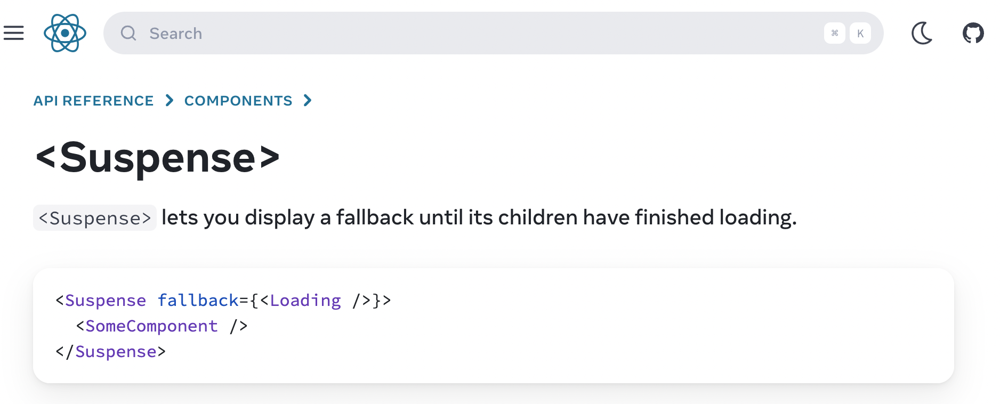

## 목차

- [React Suspense가 등장한 배경](#react-suspense가-등장한-배경)
  - [공식 문서에서 배경 읽어보기](#공식-문서에서-배경-읽어보기)
  - [Suspense 그 이전에 React Concurrent Feature부터](#suspense-그-이전에-react-concurrent-feature부터)
  - [React의 Rendering은 원래 멈출 수 없어](#react의-rendering은-원래-멈출-수-없어)
  - [React에서 렌더링이란?](#react에서-렌더링이란)
  - [다시 돌아와 Suspense는 왜 등장했나](#다시-돌아와-suspense는-왜-등장했나)
- [Reference](#reference)

## React Suspense가 등장한 배경

### 공식 문서에서 배경 읽어보기

가장 먼저, React Suspense가 등장한 배경을 알기 위해서 React 공식문서로 접근해본다.

[React Suspense 공식 문서](https://react.dev/reference/react/Suspense)

문서에서 Suspense를 검색해서 바로 보이는 화면은 아래와 같다.


`<Suspense>` 컴포넌트로, `<SomeComponent/>` 를 감싸고 있고,
`<Suspense>` 컴포넌트에는 **fallback**이라는 props에 `<Loading/>` 이라는 컴포넌트를 넣고 있다.

> EN) `<Suspense>` lets you display a fallback until its children have finished loading.

> KOR) `<Suspense>` 는 그 자식 컴포넌트가 로딩 상태가 종료될 때 까지 fallback을 보여주도록 한다.

이라고 말하며, Suspense의 역할과 기능을 소개한다.

그 외에는 딱히 어떤 배경에서 이 기능을 만들게 되었는지에 대해 설명해주는 단락이 보이지는 않는다.
단지, Suspense에 해당하는 공식 문서의 내용은 Suspense 자체에 대한 사용법과 안내사항들이 나열되어 있다.

그래서 따로 도입 배경을 찾아보기로 했다.

### Suspense 그 이전에 React Concurrent Feature부터

**Suspense**의 등장 배경을 이해하기 위해서는 기본적으로, React `v18`의 핵심인 **Concurrent Feature**에 대해 이해하고 있어야 한다.

React는 JS 위에서 동작하고, JS는 **single thread**로 동작한다. 그 말은 즉, **React는 렌더링 동작이 일어나고 있을 때 main thread를 점령**하게 되고, 이 때문에 **진행중인 작업이 다 완료**되어야지만, **user event**와 같은 **interaction**에 대한 작업을 수행할 수 있다.

이 부분은 당연하게도 사용자 경험에 악영향을 끼칠 수 있고, **web worker**를 활용하여 다른 thread를 사용하는 우회 방법도 있지만, 결국 <u>**React에서 렌더링의 우선순위를 유연하게 설계할 수 없다**</u>는 점은 분명한 한계였다.

**React Rendering** 과정의 문제점들을 해결하기 위해, React의 코어팀은 **async rendering**이라는 개념을 소개하더니, 이후 점차 발전시켜 **Concurrent Feature**를 `v18`부터 적극적으로 밀고 있다.

### React의 Rendering은 원래 멈출 수 없어

지금 이야기하는 **Concurrent Rendering**과는 달리, 따로 처리를 하지 않는다면, <u>**React의 Rendering은 기본적으로 한번 시작하면 중단할 수 없다.**</u>

별도로, **debounce**나 **throttle**과 같은 방법을 통해, 일정 시간 주기로 실행하거나 대기하도록 만드는 등의 방식으로 우회 전략을 세울 수도 있겠으나, 확실한 해결책은 될 수 없는 임시방편일 뿐이다.

**이 문제를 제대로 해결하려면, Rendering 과정에 관여하여, <u>Rendering 중단과 재개를 개발자가 컨트롤</u>** 할 수 있어야 한다.

그런데, `v17`에서 **Concurrent mode**를 opt-in으로 도입하기 시작하면서, 이제 React를 사용하는 개발자들에게 선택권이 주어지게 된다. ([React v17.0.0 릴리즈 노트 - concurrent mode](https://github.com/facebook/react/releases/tag/v17.0.0))

바로, 이제는 **React Rendering의 순서에 개입**할 수 있게 된 것이다.

React `v17`에서 `v18`로 넘어가면서, `Root`에서 `React App Component`를 렌더링하는 방식이 아래와 같이 바뀌었다.

`v17`

```jsx
import ReactDOM from "react-dom"
import App from "App"

const container = document.getElementById("app")

ReactDOM.render(<App />, container)
```

`v18`

```jsx
import ReactDOM from "react-dom"
import App from "App"

const container = document.getElementById("app")

const root = ReactDOM.createRoot(container)

root.render(<App />)
```

코드상의 차이는 크지 않지만, `createRoot`라는 새로운 API를 도입하면서, React `v18`의 기능에 접근할 수 있는 열쇠로 사용하였다.

`createRoot API`를 사용해야, `concurrent feature`를 사용할 수 있다.

### React에서 렌더링이란?

먼저 간단하게 **React가 렌더링되는 방식**을 짚고 넘어가보자.
사실 내부적으로 상당히 복잡하기 때문에, 이번 포스트에서는 간단히만 짚고 넘어가보겠다.

일단 [클래스 라이프 사이클 메소드 다이어그램](https://projects.wojtekmaj.pl/react-lifecycle-methods-diagram/)을 살펴보면, **라이프 사이클 메소드 다이어그램**을 확인할 수 있다. **React에서 렌더링과 관련된 라이프 사이클**을 확인할 수 있다.

[리액트의 렌더링은 어떻게 일어나는가?](https://yceffort.kr/2022/04/deep-dive-in-react-rendering)

위 글은 **React 렌더링** 과정을 정말 잘 정리해놓아서, 참고하면 좋다. 기본적으로 **React**는 **컴포넌트가 처음 마운트 될때**와 **state나 props에 변경사항이 발생**하면, **컴포넌트가 렌더링**된다.

> "리액트에서 렌더링이란, 컴포넌트가 현재 props와 state의 상태에 기초하여 UI를 어떻게 구성할지 컴포넌트에게 요청하는 작업을 의미한다."
>
> yceffort blog

위 인용구절처럼 결국 <u>**React는 props와 state가 변경되었을 때, 어떻게 UI에 보여줄 것인가에 초점이 맞추어져 있다.**</u>

간단히 설명하자면, **React**는 `Virtual DOM`이라는 자체적인 **DOM 자료구조**를 가지고 있다. 이것은 **브라우저의 DOM**과 매우 유사한 자료구조로, **React가 실제 DOM을 업데이트하는 과정을 최적화**하기 위한 **Buffer**처럼 작동한다.

이 `Virtual DOM`을 관리하기 위해서 **React**는 `Reconciliation`이라는 일련의 과정을 통해, **Virtual DOM과 기존의 Virtual DOM의 비교 작업을 수행하고, 변경사항을 Virtual DOM에 반영하는 과정**을 거친다.

이러한 렌더링 과정을 **React**에서는, 크게 `Render Phase`와 `Commit Phase`로 나눈다.

`Render Phase`에서는 **컴포넌트를 렌더링**하고, **변경 사항을 계산하는 작업을 수행**하고, `Commit Phase`는 **DOM에 변경사항을 적용**하는 과정을 수행한다.

이때, **계산된 모든 과정을 실제 DOM에 적용하는 과정**은 **동기 시퀀스로 수행**된다.

즉, <u>**React에서 렌더링과 이를 DOM에 적용하는 과정은 중단할 수 없다.**</u>

하지만, `Concurrent Feature` 또는 `Concurrent Mode`는 **렌더링을 일시 중지**하고, **렌더링을 다시 시작**한다거나 하는 등의 조작이 가능하다.

### 다시 돌아와 Suspense는 왜 등장했나

`Suspense`는 결국 위에서 한참 이야기했던 문제인 "**React는 개발자가 렌더링을 유연하게 설계할 수 없다**"는 것을 **해결하기 위한 도구 중 하나** 인 것이다.

`Suspense`는 React `v18`의 여러 **break change** 중 하나인 것이고, 사실 [React v16.6.0 체인지로그](https://github.com/facebook/react/blob/main/CHANGELOG.md#1660-october-23-2018)와 [React 소스코드 Github Commit - Remove unstable_prefix from Suspense #13922](https://github.com/facebook/react/pull/13922)를 보면, `v16.6.0`부터 **unstable** 딱지를 떼고 존재하던 기능이다.

물론, 당시의 `Suspense`는 지금의 `Suspense`와는 꽤나 차이가 있다. `v18` 이전에는 단순히 **JS 번들 코드**를 **Lazy Loading**하는데 쓰이는 것이었다. `v18`부터는 이러한 컨셉의 `Suspense`를 확장하여 **Data fetching**과 같은 **비동기 작업**도 `Suspense`에 적용할 수 있게 만들었다.

정리하자면, `Suspense`를 포함한 React `v18`의 `concurrent feature`들은 **React**를 사용하여 웹을 개발하는 개발자들이 <u>**React에서의 렌더링 과정을 더 정교하게 설계할 수 있도록 옵션을 준 것**</u>이라고 생각할 수 있다.

그 중 `Suspense`는 **비동기 데이터 요청**을 포함한 **컴포넌트가 준비되기까지 fallback**을 보여주는 것을 기본 기능으로, **stale 컨텐츠를 다루는 방식, 하위 컴포넌트의 준비 여부와 노출에 대한 결정 등에 관여**할 수 있게 도와준다.

`Suspense`는 **비동기 데이터 소스**를 통해 제어되고, `Suspense` 컴포넌트를 감싸 **그 경계를 세워두는 방식**으로 API를 제공한다. 개발자가 `Suspense` 경계를 직접 나누면서, <u>**비동기 데이터가 준비되고 있는 동안에는 해당 컴포넌트가 중단(Suspensed)되고, 실제로 데이터가 로드되었을 때 해당 컴포넌트를 렌더링**</u>한다.

즉, 이제 React를 사용하는 개발자는 **어떤 컴포넌트를 언제 렌더링 중단 및 시작시킬지를 정할 수 있는 것**이다. 특히 `Suspense` 기능을 통해서는 **비동기 데이터 요청의 완료 여부**를 기준으로 **렌더링을 중단하고 시작**할 수 있는 것이다.

결론적으로, `Suspense`는 <u>**React의 발전 흐름 상, 렌더링 과정을 컨트롤 할 수 있도록 만들어 주기위해서 나온 기능 중 하나**</u>이고, 특히 <u>**비동기 데이터 요청을 기준으로 한 렌더링 여부 처리를 개발자가 쉽게 컨트롤**</u>할 수 있도록 React에서 제공하는 기능인 것이라고 할 수 있다.

## Reference

0. [Suspense | react-ko 공식 문서](https://ko.react.dev/reference/react/Suspense)
1. [Suspense in React 18: How it works, and how you can use it - By Peter Kellner | October 09, 2022](https://www.pluralsight.com/blog/software-development/suspense-react-18-explained)
2. [Concurrent React - jay·2022년 8월 4일](https://velog.io/@jay/Concurrent-React)
3. [리액트 18의 신기능 - 동시성 렌더링(Concurrent Rendering), 자동 일괄 처리(Automatic Batching) 등 - 2023년 2월 23일 Translator: Jeong Won Yoo Author: Shruti Kapoor (English)](https://www.freecodecamp.org/korean/news/riaegteu-18yi-singineung-dongsiseong-rendeoring-concurrent-rendering-jadong-ilgwal-ceori-automatic-batching-deung/)
4. [리액트의 렌더링은 어떻게 일어나는가? | yceffort - 2022-04-09](https://yceffort.kr/2022/04/deep-dive-in-react-rendering)
5. [Understanding React Reconciliation in React 18: A Deep Dive](https://medium.com/@souviksen093/understanding-react-reconciliation-in-react-18-a-deep-dive-16b083e5592a)
6. [CSR 환경에서 Suspense로 발생한 문제 해결하고 성능 개선하기 | 카카오페이 블로그 - 2023. 11. 23](https://tech.kakaopay.com/post/react-router-dom-csr-prefetch/)
7. [Suspense for Data Fetching의 작동 원리와 컨셉 (feat.대수적 효과) | 김맥스 블로그](https://maxkim-j.github.io/posts/suspense-argibraic-effect/)
8. [Suspense와 선언적으로 Data fetching처리 | 카카오 엔터테인먼트 기술 블로그 - 2021.12.09](https://fe-developers.kakaoent.com/2021/211127-211209-suspense/)
9. [Suspense 도입과 Waterfall 현상 해결하기 | seungchan\_\_y - 2023년 2월 13일](https://velog.io/@seungchan__y/Suspense-%EB%8F%84%EC%9E%85%EA%B3%BC-Waterfall-%ED%98%84%EC%83%81-%ED%95%B4%EA%B2%B0%ED%95%98%EA%B8%B0)
